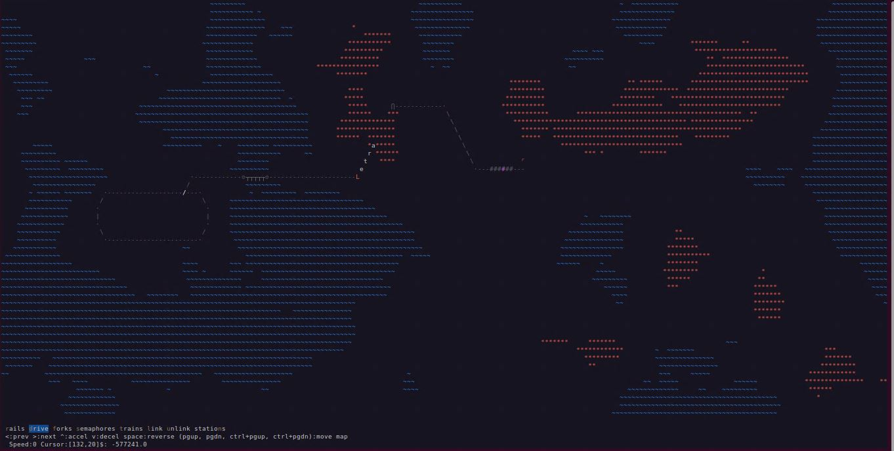
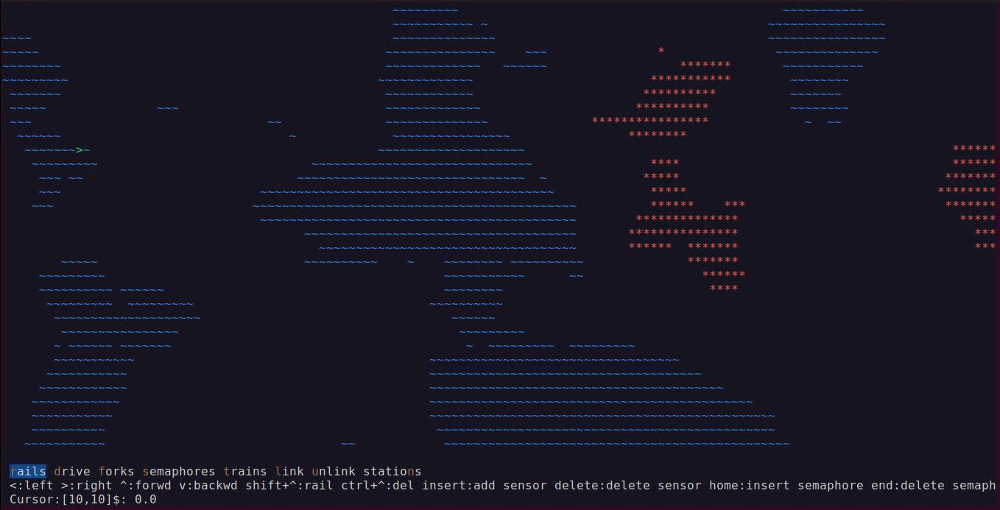
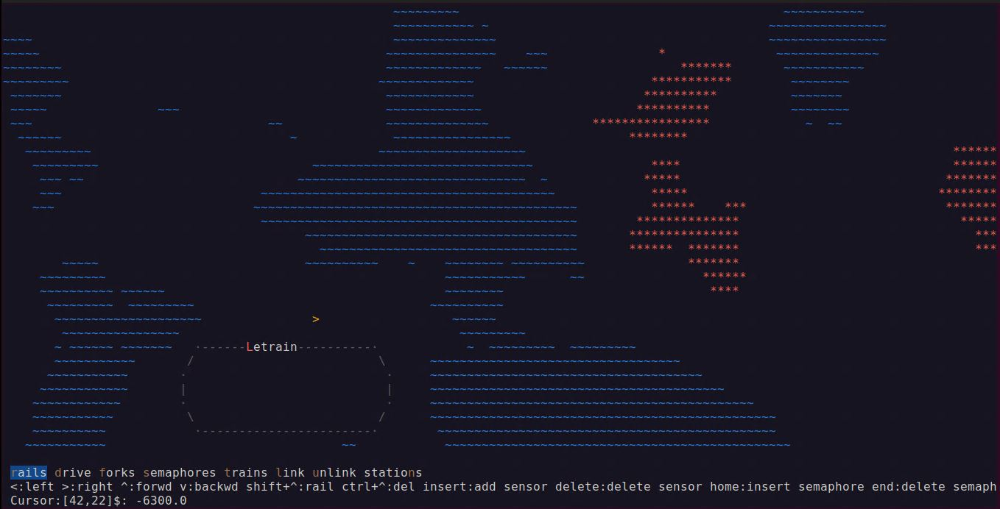
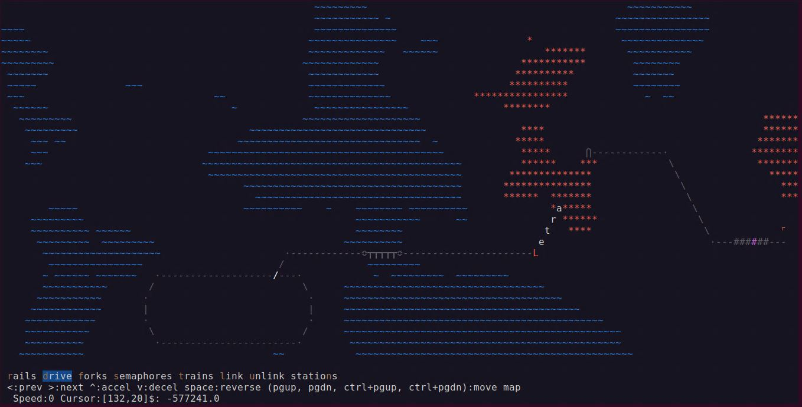
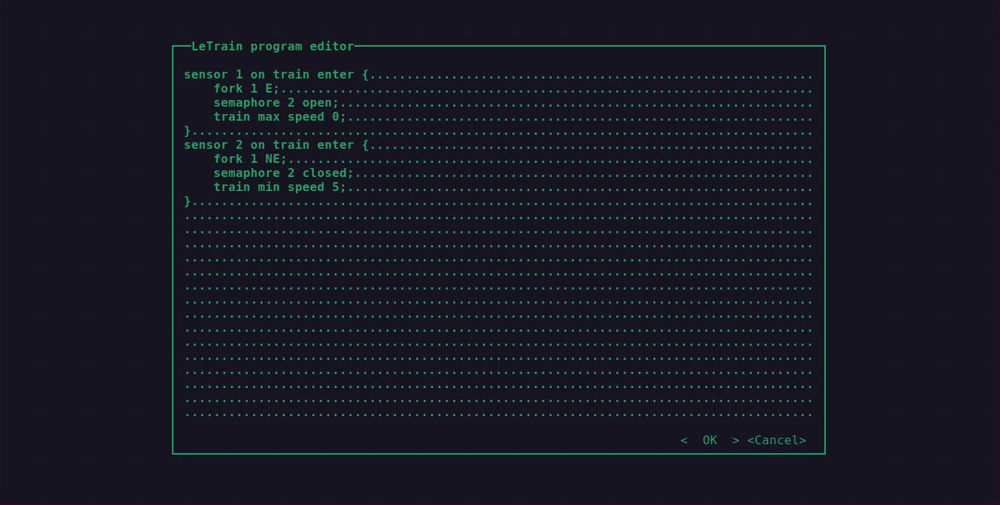
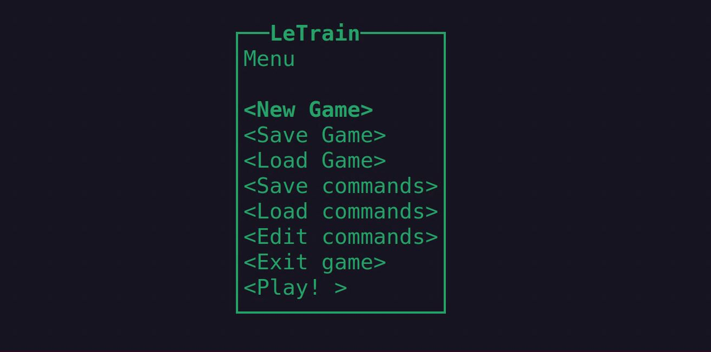

 
<a name="readme-top"></a>

[![Contributors][contributors-shield]][contributors-url]
[![Forks][forks-shield]][forks-url]
[![Stargazers][stars-shield]][stars-url]
[![Issues][issues-shield]][issues-url]
[![MIT License][license-shield]][license-url]


```
     __       ______           _
    / /   ___/_  __/________ _(_)___
   / /   / _ \/ / / ___/ __ `/ / __ \
  / /___/  __/ / / /  / /_/ / / / / /
 /_____/\___/_/ /_/   \__,_/_/_/ /_/

       The Letter Train Simulator           
  (C) 2006-2023 Antonio Vazquez Araujo 
```

<!-- PROJECT LOGO -->
<br />
<div align="center">

<h1 align="center">LeTrain</h1>

  <p align="center">
    Letrain is a train simulator made for the ascii terminal
    <br />
    <a href="https://github.com/antoniovazquezaraujo/letrain"><strong>Explore the docs »</strong></a>
    <br />
    <br />
    <a href="https://github.com/antoniovazquezaraujo/letrain">View Demo</a>
    ·
    <a href="https://github.com/antoniovazquezaraujo/letrain/issues">Report Bug</a>
    ·
    <a href="https://github.com/antoniovazquezaraujo/letrain/issues">Request Feature</a>
  </p>
</div>


<!-- TABLE OF CONTENTS -->
<details>
  <summary>Table of Contents</summary>
  <ol>
    <li>
      <a href="#about-the-project">About The Project</a>
      <ul>
        <li><a href="#built-with">Built With</a></li>
      </ul>
    </li>
    <li>
      <a href="#getting-started">Getting Started</a>
      <ul>
        <li><a href="#prerequisites">Prerequisites</a></li>
        <li><a href="#installation">Installation</a></li>
      </ul>
    </li>
    <li><a href="#usage">Usage</a></li>
    <li><a href="#roadmap">Roadmap</a></li>
    <li><a href="#contributing">Contributing</a></li>
    <li><a href="#license">License</a></li>
    <li><a href="#contact">Contact</a></li>
    <li><a href="#acknowledgments">Acknowledgments</a></li>
  </ol>
</details>


<!-- ABOUT THE PROJECT -->
## About The Project
LeTrain is a train simulator that can be played on any ascii terminal. It consists of creating tracks and stations along a virtually infinite map, creating trains and earning money by carrying passengers between them. It will be more profitable the farther apart they are. 

**Warning 
This is a preliminary version. There are still many things that are pending. At the moment it works but one day it will be much better than it is now.



<p align="right">(<a href="#readme-top">back to top</a>)</p>


### Built With
* Java OpenJdk 17
* [Lanterna library](https://github.com/mabe02/lanterna)

<p align="right">(<a href="#readme-top">back to top</a>)</p>

<!-- GETTING STARTED -->
## Getting Started

### Prerequisites

* Java JDK 17 
* Apache Maven

### Installation
To install it
* Clone it
   ```sh
   git clone https://github.com/antoniovazquezaraujo/letrain.git
   ```
* Install it
	```sh
	mvn clean install
	```
* Run it
	```sh
	java -jar target/JLeTrain-<version>-jar-with-dependencies.jar
	``` 

<p align="right">(<a href="#readme-top">back to top</a>)</p>

<!-- USAGE EXAMPLES -->
## Usage

### Ground, Water and Rock
This is the general appearance of LeTrain. On the map, randomly generated for each game, you can see water areas in blue, mountain areas in orange and the dark area which is normal ground. Building tracks across normal ground is fast and cheap, however, creating bridges to cross lakes or drilling tunnels to cross mountains is slow and expensive.
At the bottom you can see the menu, where the different game modes are selected, which will allow us to create tracks, build wagons and locomotives, turnouts, traffic lights and programmable sensors.
Each option is activated with the letter that appears in a different color, for example, to enter "drive" mode use the "d" key.


### Tracks and trains
To create tracks on the map just select the "rails" mode and move with the cursor. Holding down the shift key will generate tracks and with control you can delete them. Turnouts and crossovers are created automatically. Once we have tracks, we just have to go to "trains" mode, which will allow us to create wagons (any lower case letter) and locomotives (any upper case letter).

**To exit this mode you need to press Enter.

### Infinite map
If you leave the page with the cursor, you will see that the map continues. There is no limit but memory. If you find that the cursor is moving too slowly, you can type any number before using it, and each step will be added to that number of steps. For example, if you type 30, each time you press the advance key, 31 steps will be advanced, the default step plus the other 30. (If you are a Vim user (cheers Bram, wherever you are) you will be familiar with this kind of quantifier).


### Programmable sensors
On any rail you can install a sensor if you want things to happen when a train passes over it, e.g. change a turnout, decelerate the train, change the state of a traffic light, etc. LeTrain's mini programming language is super simple, you won't have to learn almost anything.


### Saving the status
You can save the LeTrain status in a file at any time. You can also save the sensor programming in another file. The latter is a simple plain text file, which you can edit with your favorite editor or with the basic LeTrain editor.


### Zoom
You can use the console zoom keys to see more or less scenery when you need it. They are usually assigned to ctrl-+ and ctrl--.
You can also use the PgUp and PgDown keys to move up and down pages or ctrl+PgUp or ctrl+PgDown to move across pages horizontally. It is easy to get lost, to go back just switch to "drive" mode and select with the arrows the next or previous locomotive. The same with crossovers, stations, sensors, etc. You can also select objects by their number, just type the number and the object will be selected.
<video src="images/Library%20_%20Loom%20-%2022%20August%202023.mp4" controls title="Title"></video>

### Train crash
In effect: if two trains approach each other at a speed greater than 1, a catastrophe will occur. You will lose the money you have spent to create them. The money is the number at the bottom right of the menu. It decreases when trains move, and when tracks are built. It increases when trains pick up passengers at stations.
<video src="images/Library%20_%20Loom%20-%2022%20August%202023%20(3).mp4" controls title="Title"></video>

### Linking and unlinking
When creating wagons and locomotives they do not form a train, they are unlinked. To create a train you need to have the locomotive next to them and select "link" and then choose the direction to look for wagons. Then, with the space bar you will link all the wagons that are together. That will be a train. To unlink wagons, select "unlink", select the direction and move forward or backward to the wagon where you want to split. Then use the space bar
<video src="images/Library%20_%20Loom%20-%2022%20August%202023%20(4).mp4" controls title="Title"></video>


 _For more examples, please refer to the [Documentation](https://github.com/antoniovazquezaraujo/letrain)_

<p align="right">(<a href="#readme-top">back to top</a>)</p>

<!-- ROADMAP -->
## Roadmap

There are many things to do, but for the moment it works.
- [ ] Add sound
- [ ] Add cities
- [ ] Improve gameplay
- [ ] User manual

See the [open issues](https://github.com/antoniovazquezaraujo/letrain/issues) for a full list of proposed features (and known issues).

<p align="right">(<a href="#readme-top">back to top</a>)</p>


<!-- CONTRIBUTING -->
## Contributing

Contributions are what make the open source community such an amazing place to learn, inspire, and create. Any contributions you make are **greatly appreciated**.

If you have a suggestion that would make this better, please fork the repo and create a pull request. You can also simply open an issue with the tag "enhancement".
Don't forget to give the project a star! Thanks again!

1. Fork the Project
2. Create your Feature Branch (`git checkout -b feature/AmazingFeature`)
3. Commit your Changes (`git commit -m 'Add some AmazingFeature'`)
4. Push to the Branch (`git push origin feature/AmazingFeature`)
5. Open a Pull Request

<p align="right">(<a href="#readme-top">back to top</a>)</p>


<!-- LICENSE -->
## License

Distributed under the MIT License. See `LICENSE.txt` for more information.

<p align="right">(<a href="#readme-top">back to top</a>)</p>


<!-- CONTACT -->
## Contact

Antonio Vazquez Araujo - [@twitter_handle](https://twitter.com/avaraujo) - antoniovazquezaraujo@gmail.com

Project Link: [https://github.com/antoniovazquezaraujo/letrain](https://github.com/antoniovazquezaraujo/letrain)

<p align="right">(<a href="#readme-top">back to top</a>)</p>


<!-- MARKDOWN LINKS & IMAGES -->
<!-- https://www.markdownguide.org/basic-syntax/#reference-style-links -->
[contributors-shield]: https://img.shields.io/github/contributors/antoniovazquezaraujo/letrain.svg?style=for-the-badge
[contributors-url]: https://github.com/antoniovazquezaraujo/letrain/graphs/contributors
[forks-shield]: https://img.shields.io/github/forks/antoniovazquezaraujo/letrain.svg?style=for-the-badge
[forks-url]: https://github.com/antoniovazquezaraujo/letrain/network/members
[stars-shield]: https://img.shields.io/github/stars/antoniovazquezaraujo/letrain.svg?style=for-the-badge
[stars-url]: https://github.com/antoniovazquezaraujo/letrain/stargazers
[issues-shield]: https://img.shields.io/github/issues/antoniovazquezaraujo/letrain.svg?style=for-the-badge
[issues-url]: https://github.com/antoniovazquezaraujo/letrain/issues
[license-shield]: https://img.shields.io/github/license/antoniovazquezaraujo/letrain.svg?style=for-the-badge
[license-url]: https://github.com/antoniovazquezaraujo/letrain/blob/master/LICENSE.txt
