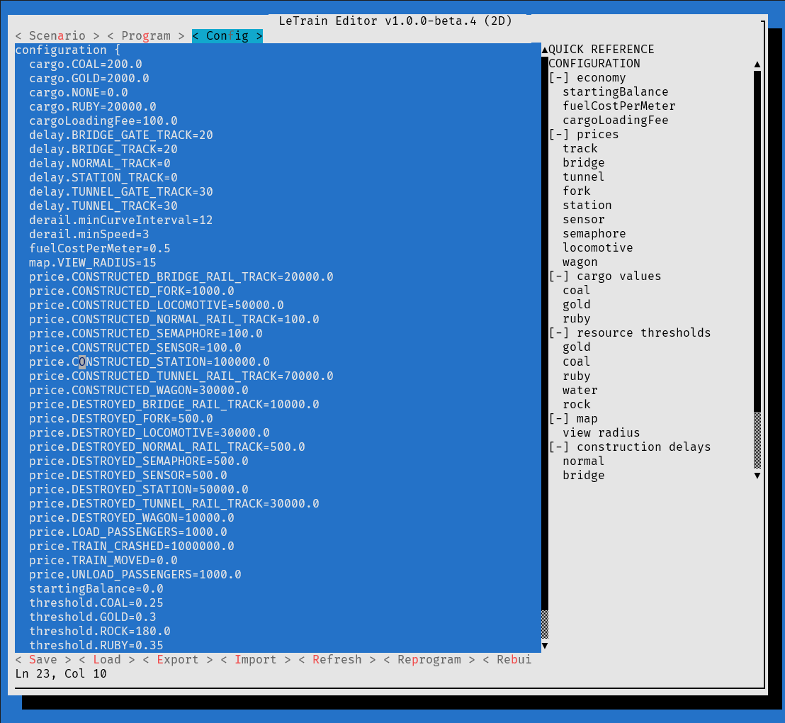

# LeTrain 🚂✨

<p align="left">
  <a href="https://github.com/antoniovazquezaraujo/LeTrain/actions/workflows/ci.yml"></a>
  <a href="https://github.com/antoniovazquezaraujo/LeTrain/releases"></a>
  <a href="https://opensource.org/licenses/Apache-2.0"></a>
  
</p>

```text
      __       ______           _
     / /   ___/_  __/________ _(_)___
    / /   / _ \/ / / ___/ __ `/ / __ \
   / /___/  __/ / / /  / /_/ / / / / /
  /_____/\___/_/ /_/   \__,_/_/_/ /_/
       The Letter Train Simulator           
   (C) 2006-2026 Antonio Vazquez Araujo 
```

<p align="center">
  <a href="https://github.com/antoniovazquezaraujo/LeTrain/releases/latest">
    
  </a>
  <a href="https://avaraujo.itch.io/letrain-procedural-tycoon">
    
  </a>
  <a href="https://snapcraft.io/letrain">
    
  </a>
  <br><br>
  <a href="https://antoniovazquezaraujo.github.io/LeTrain/">
    
  </a>
</p>

<p align="center">
  
</p>

**LeTrain** is a procedural train simulator that blends classic ASCII aesthetics with a modern 3D engine. Build vast rail networks across an infinite world, manage a complex economy, and master the art of logistical efficiency.

---

## 🌟 New in 2026: The 3D Evolution
LeTrain has evolved! While maintaining its terminal roots, it now features a **high-performance 3D engine** powered by LibGDX:
- **Modern Perspective**: Explore your rail empire in full 3D with smooth orbiting cameras.
- **Classic Soul**: Industrial zones and trains retain their iconic character-based charm, now rendered as physical 3D objects.
- **Visual Polish**: Dynamic transparency for mountains, semantic color-coded stations, and high-resolution typography.

## 🎬 Record, Undo & Scenarios
The editing workflow is now first-class — in both the 2D and 3D clients:
- **Record/edit mode (`R`)**: freeze the world, build instantly, and journal every edit.
- **Undo / redo**: `u` and **Ctrl+R** (or `undo;` / `redo;`), for construction *and* state changes (forks, semaphores, signals).
- **Scenarios (`.ltr`)**: export your whole network as a small text recipe and import anyone else's. The same seed rebuilds the same world, so a scenario travels as plain text. Validate one headlessly with the bundled **`letrain-check`**.
- **Built-in editor (`p`)**: a tabbed Scenario / Program / Config editor with a per-tab quick reference and error navigation.
- **Experiment mode (`X`)**: snapshot the live world, try anything, then restore it.

<p align="center">
  
</p>

## 💰 Deep Economy & Industry
The game now features a fully integrated financial system:
- **Capital Management**: Start with **$0** (Zero-to-Hero challenge) and grow your wealth.
- **Logistics Engine**: Transport specialized cargo (**GOLD**, **COAL**, **RUBY**) from Producers to Consumers.
- **Smart Pricing**: Revenue scales with travel distance. Every meter counts!
- **Construction Costs**: Balancing infrastructure expansion vs. operational fuel costs.
- **Configurable Gameplay**: Fine-tune the entire game via the `letrain.cfg` file (it ships next to the launchers).

## 🌍 Infinite Procedural World
- **Entropy Booster**: Every new game starts at a unique, randomized coordinate (±10k to ±100k units) to ensure fresh exploration every time.
- **Procedural Landscapes**: Navigate through lakes, forests, and towering mountains generated by custom Perlin noise.
- **Frustum Culling**: Optimized rendering engine handles massive maps by only processing what you see.

---

## 🚀 Getting Started

### Prerequisites
- **Java JDK 17** or higher.
- **Maven**.

### Quick Launch
The build system is fully automated. Simply run:
```bash
mvn clean package -DskipTests
```
This generates three standalone distributions in `output/`:
- **`output/LeTrain`** — the modern **3D** experience.
- **`output/LeTrain2D`** — the classic, high-speed **ASCII terminal** view.
- **`output/letrain-check`** — the headless scenario (`.ltr`) validator.

A default `letrain.cfg` ships next to each launcher, so you can tweak the game without touching the code.

### Launchers
- **`LeTrain`** (or `.exe` / `.sh`): Launches directly into **3D mode**.
- **`LeTrain2D`** (or `.exe` / `.sh`): For those who prefer the classic terminal view.
- **`letrain-check <file.ltr>`**: Validates a scenario file and prints `file:line:col` diagnostics.

---

## 🛠️ Tech Stack
- **Core**: Java 17
- **3D Engine**: LibGDX (OpenGL)
- **Terminal UI**: Lanterna
- **Scripting**: Custom ANTLR4-based rail automation language.
- **Audio**: Granular synthesis engine for realistic locomotive sounds.

## 🤝 Contributing
Contributions are welcome! Whether it's bug fixes, performance improvements, or new "letter" models for wagons, feel free to open a Pull Request.

---
*Created by Antonio Vazquez Araujo.*  
[Twitter/X - @avaraujo](https://twitter.com/avaraujo) | [GitHub](https://github.com/antoniovazquezaraujo)

## ⚠️ Known Issues

### Snap Package Limitations (WSL2 & Remote Desktop)
Because the **Snap package** uses strict sandboxing and bundles its own graphics/audio libraries, it may not function correctly in virtualized or remote environments:

* **Windows Subsystem for Linux (WSL2 / WSLg):** The Snap version will run without audio. This is due to a known AppArmor sandbox restriction that prevents the Snap from accessing Microsoft's non-standard PulseAudio socket (`/mnt/wslg/PulseServer`).
* **Remote Desktop (XRDP / VNC):** 
  * The **3D version** will crash on startup with OpenGL errors (`Failed to create context: BadValue`, `swrast` fallback failures). Snap's bundled Mesa graphics drivers conflict with the virtual X11 display created by XRDP.
  * The **2D version** will not stream audio over the network. ALSA directly accesses the host's physical sound card instead of routing through XRDP's virtual PulseAudio sinks.

**Solution:** If you are playing over a Remote Desktop connection on Linux, compile the game from source or use the `.sh` launcher from the Linux `.zip` release, which perfectly adapts to the host's XRDP drivers. If you are playing on Windows, download the native **`LeTrain-Windows.zip`** from the [Releases](https://github.com/antoniovazquezaraujo/LeTrain/releases) page for perfect 3D acceleration and sound.
