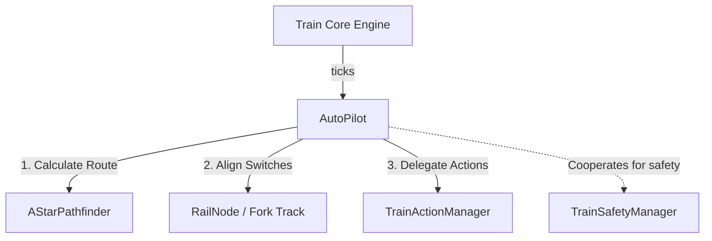
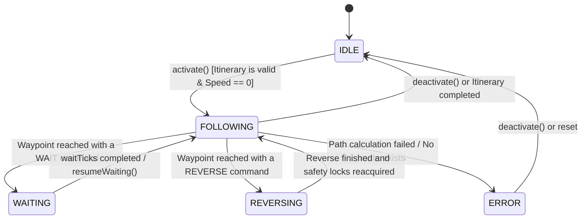
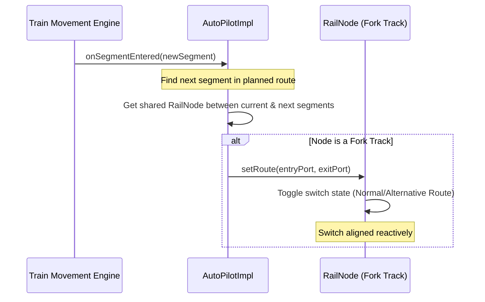

# AutoPilot System Analysis - LeTrain

This document provides a comprehensive analysis of the **AutoPilot** system in LeTrain, detailing its architecture, state machine, interactions, and integration with the safety and routing engines.

---

## 1. Overview & Core Responsibility

The `AutoPilot` system is responsible for autonomously driving a train along a defined sequence of destinations called an `Itinerary`. The itinerary consists of multiple `Waypoint`s (such as Stations or Sensors) containing list of `WaypointCommand`s (e.g., loading, unloading, reversing, or waiting).

Unlike periodic physics systems that poll the entire world, the LeTrain autopilot is designed to be **reactive** and **event-driven**. It calculates path segments lazily, sets fork routes on the fly, and collaborates closely with the safety manager to handle exclusive block reservation.

---

## 2. Interface Contracts & Operational Modes

The [AutoPilot](file:///home/antonio/dev/LeTrain/src/main/java/letrain/itinerary/AutoPilot.java) interface defines the contract, and [AutoPilotImpl](file:///home/antonio/dev/LeTrain/src/main/java/letrain/itinerary/impl/AutoPilotImpl.java) implements it.

### Public API Methods
*   `setItinerary(Itinerary)`: Assigns an itinerary and resets index and route.
*   `activate()`: Transitions from `IDLE` to `FOLLOWING` if a valid itinerary is assigned.
*   `deactivate()`: Stops the autopilot, returning the train to manual mode.
*   `onSegmentEntered(Segment)`: Triggered reactively when the train enters a new logical segment.
*   `ensureForkRoute(Segment from, Segment to)`: Examines the shared node between two segments and configures the track switch.
*   `replaceRouteSegment(Segment old, Segment new)`: Modifies the planned route dynamically (e.g., during live rerouting or bypasses).

### Operational Modes (`AutoPilot.Mode`)

The autopilot transitions through five distinct states:

| Mode | Description |
| :--- | :--- |
| **`IDLE`** | Autopilot is inactive or has finished its itinerary. Control is manual. |
| **`FOLLOWING`** | The train is moving towards the current waypoint following a calculated list of `Segment`s. |
| **`WAITING`** | The train is temporarily stopped at a waypoint executing a `WAIT` command. |
| **`REVERSING`** | The train is executing a `REVERSE` command, changing direction and updating safety blocks. |
| **`ERROR`** | An unrecoverable routing error has occurred (e.g., path not found to next waypoint). |

---

## 3. State Machine & Transitions

The following state machine details how the autopilot transitions between different operational modes:

---

## 4. Key Routing & Alignment Mechanics

### A. Lazy Route Calculation (`calculateRoute()`)
When activated, or when the train enters a segment not present in the current cached route, the autopilot requests a path from the `SegmentPathfinder`:
1.  **Current Segment**: Derived from the train's head physical track position.
2.  **Target Segment**: Derived from the coordinates of the target station or sensor specified in the current waypoint.
3.  **Path Search**: Runs the A* algorithm (`AStarPathfinder`) seeking a sequence of `Segment`s. The search respects the waypoint's preferred `entryDir` constraint.
4.  **Failure**: If no path is found, the system logs a warning, and the autopilot stops or triggers a retry cooldown.

### B. Reactive Fork Switch Alignment (`ensureForkRoute`)
The autopilot must set the track switches ahead of the train before it enters a fork. This is executed reactively inside the `onSegmentEntered(Segment newSegment)` event handler:

---

## 5. Integration with other Systems

The autopilot operates at the intersection of several crucial subsystems:

### A. Pathfinder (`SegmentPathfinder`)
The `AutoPilot` utilizes [AStarPathfinder](file:///home/antonio/dev/LeTrain/src/main/java/letrain/itinerary/AStarPathfinder.java) to find segment paths. The search is heavily constrained:
*   **Physical Track Cost**: Pathfinding does not just minimize segment count; it queries the graph for track count (`getTrackCount(Segment)`) to prefer shorter physical paths.
*   **Directional Constraints**: It respects the waypoint's `entryDir` (if defined), ensuring the train arrives in the correct orientation.

### B. Safety Engine (`TrainSafetyManager`)
The safety manager operates reactively during movement:
*   When the train enters a fork, the `TrainSafetyManager` locks the next segment ahead and triggers emergency braking if the segment is occupied.
*   The autopilot assists by aligning forks beforehand using `ensureForkRoute`, ensuring the train safety manager's look-ahead calculations correspond to the path the train will actually take.

### C. Action Engine (`TrainActionManager`)
The [TrainActionManager](file:///home/antonio/dev/LeTrain/src/main/java/letrain/itinerary/impl/TrainActionManager.java) handles waypoint arrival and command execution:
1.  **Arrival Check**: In every tick, it checks if the train is at the target waypoint.
2.  **Commands**: Upon arrival, it pulls the commands defined in the waypoint:
    *   `LOAD`/`UNLOAD`: Triggers station cargo transfer.
    *   `WAIT`: Puts the autopilot into `WAITING` mode for $N$ seconds.
    *   `REVERSE`: Initiates direction reversal, which resets safety manager locks.
3.  **Advance**: Once all commands are executed, it advances the waypoint index, clears the old route, and transitions the autopilot back to `FOLLOWING`.

---

## 6. Serialization & State Persistence

To support game saving and loading, the autopilot state is serialized using a Jackson mix-in class named [AutoPilotMixin](file:///home/antonio/dev/LeTrain/src/main/java/letrain/mvp/impl/AutoPilotMixin.java).

*   **Serialized Fields**:
    *   `itinerary`: The complete itinerary definition.
    *   `mode`: The current operational mode name.
    *   `currentIndex`: The index of the active waypoint.
    *   `waitTicks`: Remaining wait ticks if in `WAITING` mode.
    *   `pendingCommands`: List of commands that are queued for execution at the active waypoint.
*   **Deserialization**: Jackson rebuilds the `AutoPilotImpl` using a specialized constructor, which is later reconnected to the live `Train` and `TrainActionManager` references via `reinitialize(Train, TrainActionManager)`.

---
*Document prepared on 2026-06-09 by Dani (Coordinador)*
