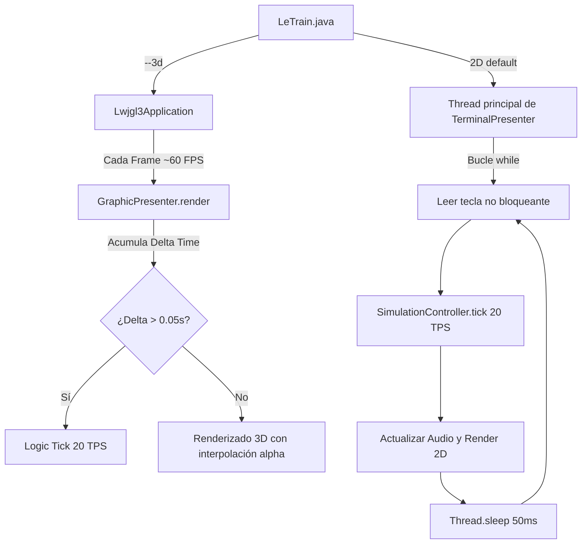
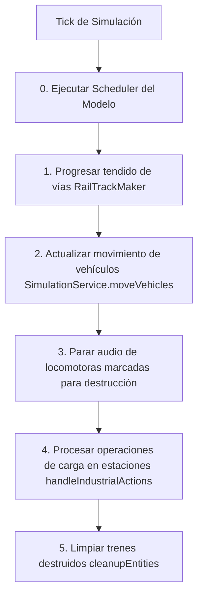
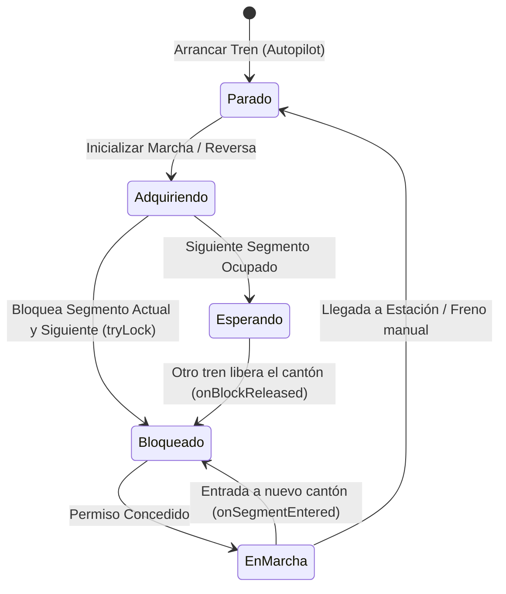

[ [Índice] ] [[docs/architecture/Overview|⬅️ Arquitectura]] · [[docs/Index|⬅️ Volver al Índice]]

# Bucle Principal del Juego (Game Loop)

## Visión General

LeTrain tiene dos modos de ejecución — **Terminal 2D** y **LibGDX 3D** — pero comparten el mismo motor de simulación. La diferencia principal es cómo se orquesta el bucle y cómo se renderiza.

```
┌─────────────────────────────────────────────────────────────────────────┐
│                         main() (LeTrain.java)                           │
│                                                                         │
│  Model model = new Model()                                              │
│                                                                         │
│  ┌── ¿--3d? ────────────────────────────────────────────────────────┐   │
│  │  NO                                       SÍ                     │   │
│  │  ▼                                        ▼                      │   │
│  │  TerminalPresenter(model)                 GraphicPresenter(model)│   │
│  │  presenter.start()                        Lwjgl3Application(p)   │   │
│  │    ┌──────────────┐                       ┌──────────────┐       │   │
│  │    │ Bucle propio │                       │ render()     │       │   │
│  │    │ while running│                       │ (callback    │       │   │
│  │    │              │                       │  LibGDX)     │       │   │
│  │    │ 20 FPS       │                       │ ~60 FPS      │       │   │
│  │    │ lockstep     │                       │ visual       │       │   │
│  │    └──────────────┘                       │ 20 TPS sim   │       │   │
│  │                                           └──────────────┘       │   │
│  │                                                                  │   │
│  └──────────────────────────────────────────────────────────────────┘   │
│                                                                         │
│  Ambos comparten:                                                       │
│  ┌─────────────────────────────────────────────────────────────────┐    │
│  │ simulationController.tick()  ← 20 TPS fijo                      │    │
│  │ Model (misma instancia)                                         │    │
│  └─────────────────────────────────────────────────────────────────┘    │
└─────────────────────────────────────────────────────────────────────────┘
```

---

## 1. Los Dos Bucles de la Capa de Presentación

La actualización lógica del juego y el dibujado en pantalla siguen estrategias diferenciadas según el modo de ejecución seleccionado.



### A. Bucle 2D (TerminalPresenter)

En el presentador de la terminal ([TerminalPresenter.java](file:///home/antonio/dev/LeTrain/src/main/java/letrain/mvp/impl/terminal/TerminalPresenter.java)), el bucle se ejecuta de manera síncrona en el hilo principal dentro del método `start()`:
*   **Frecuencia**: Se limita a aproximadamente **20 Ticks por segundo (TPS)** mediante una llamada a `Thread.sleep(50)` al final de cada iteración.
*   **Lectura de Entrada**: Realiza polling de teclado no bloqueante usando Lanterna. Consume y vacía el búfer de entrada en cada ciclo para evitar retardos (*input lag*).
*   **Actualización Lógica**: Invoca a `SimulationController.tick()`.
*   **Sincronización de Audio**: Actualiza la posición y orientación del oyente de SLF4J/AudioController (siguiendo a la locomotora seleccionada en modo `DRIVE` o al cursor en otros modos).
*   **Dibujado**: Utiliza el patrón **Visitor** (`RenderVisitor` e `InfoVisitor`) para componer el búfer de caracteres que luego la vista pinta en el terminal (`view.paint()`).

### B. Bucle 3D (GraphicPresenter via LibGDX)

LibGDX llama a `render()` cada vez que el monitor refresca (~60 FPS). El bucle separa la simulación (20 TPS) del renderizado (variable):
*   **Frecuencia Lógica**: Para garantizar que las físicas del juego se comporten exactamente igual que en 2D, se implementa un acumulador de tiempo delta:
    ```java
    stateTime += Gdx.graphics.getDeltaTime();
    if (stateTime > 0.05f) {
        simulationController.tick();
        // ...
        stateTime -= 0.05f;
    }
    ```
    Esto fija la simulación física a **20 TPS**, independientemente de la velocidad de fotogramas del render.
*   **Interpolación de Movimiento**: Se calcula una variable `alpha = stateTime / 0.05f` para interpolar suavemente la posición de los trenes en pantalla entre dos estados lógicos de la cuadrícula física.
*   **Actualización de Cámara y Audio**: La cámara 3D se desplaza usando interpolación. Inmediatamente después, el oyente de audio se sincroniza con las coordenadas tridimensionales de la cámara y su ángulo.
*   **Renderizado 3D y Transparencias**: 
    - Utiliza un `ModelBatch` para dibujar las mallas 3D de las vías, el terreno procedural (generado por Perlin Noise) y los vagones.
    - Emplea un sistema de decals (`DecalBatch`) para orientar las etiquetas con texto y números identificadores hacia la perspectiva del jugador.
    - Implementa una renderización en **dos pasadas para transparencias** (cáscaras translúcidas en túneles/montañas), rellenando primero el búfer de profundidad (Z-Buffer) antes de escribir el canal de color, garantizando que el interior de las montañas se vea correctamente sin solapamiento erróneo.

### Comparativa de Características

| Aspecto | Modo 2D Terminal | Modo 3D LibGDX |
|---|---|---|
| **FPS** | 20 fijos (bloqueante con `Thread.sleep(50)`) | Variable (monitor refresh, ~60 FPS) |
| **TPS** | 20 (atado al render, mismo hilo) | 20 fijos (acumulador de tiempo, independiente del render) |
| **Input** | Polling: `screen.pollInput()` cada frame | Callbacks: `keyDown()`, `keyUp()`, `keyTyped()` |
| **Render** | Texto en terminal (Lanterna) | OpenGL 3D con modelos, luces, sombras |
| **Cámara** | Scroll por páginas, salto cuando cambia de cuadrícula | 3 modos: ORBIT (seguimiento), CAB (cabina), MAP (vista cenital) |
| **Animación** | Instantánea (sin interpolación entre frames) | Interpolación lineal `alpha` entre ticks (movimiento suave) |
| **Audio** | Oyente = cursor o locomotora seleccionada | Oyente = cámara, con orientación tridimensional |

---

## 2. El Bucle de Simulación Lógica (Simulation Tick)

Ambos modos llaman exactamente al mismo método en [SimulationController.java](file:///home/antonio/dev/LeTrain/src/main/java/letrain/mvp/impl/SimulationController.java) para actualizar el estado del mundo de forma determinista:



1.  **Scheduler Lógico**: El planificador del juego comprueba si hay eventos de scripts programados o temporizadores que deben dispararse en este instante (`model.getScheduler().tick()`).
2.  **Construcción de Vías**: Si el jugador está tendiendo vías manualmente en modo de edición, se progresa la colocación de raíles (`trackMaker.makeTracks()`).
3.  **Movimiento y Físicas**: Se desplazan los trenes mediante el método `simulationService.moveVehicles()`.
4.  **Desconexión de Audio**: Se detienen los sintetizadores de sonido de aquellas locomotoras que hayan descarrilado o se encuentren en estado de destrucción inminente.
5.  **Acciones Industriales y Economía**:
    - Las estaciones productoras regeneran mercancía periódicamente (5% de probabilidad por tick).
    - Se procesa la transferencia de mercancías entre vagones y estaciones (`processTrainLoading`). Si un tren está detenido cargando o descargando, se consume un contador de duración de carga.
    - Se detectan las variaciones de volumen de carga en los vagones para calcular los ingresos económicos y costes de transporte a través de la distancia recorrida (`EconomyManager`).
6.  **Recolección de Entidades**: Se actualizan los temporizadores de colisión y destrucción de vehículos destruidos (`cleanupEntities`). Si el humo/escombros expiran, se eliminan del mapa y se liberan permanentemente las reservas de vías que retenían.

---

## 3. Físicas y Mecánicas de Movimiento de Trenes

El movimiento físico de los trenes en la rejilla de vías está regulado para simular la tracción e inercia ferroviaria:

### A. Control de Frecuencia por Inercia
Las locomotoras gestionan su velocidad física de forma escalonada. 
*   **Velocidad Física vs. Lógica**: El usuario selecciona una velocidad objetivo (`targetSpeed`, entre 0 y 10). La locomotora ajusta gradualmente su velocidad real (`currentSpeed`) para reflejar la inercia (aceleración/frenado).
*   **Cálculo de Intervalos (`turns`)**: Un tren no se mueve a la misma velocidad en cada tick. Inmediatamente, el juego calcula un número de ticks de espera entre cada avance de celda física:
    $$\text{turns} = \frac{50}{\text{currentSpeed}}$$
    *   A velocidad máxima (10), el tren se desplaza a una nueva vía cada 5 ticks (250 ms).
    *   A velocidad mínima (1), espera 50 ticks (2.5 segundos) por casilla.
    *   En cada tick lúdico, se consume un turno. Al llegar a cero, se intenta dar un paso físico en las vías.

### B. Algoritmo de Avance en Dos Fases
El desplazamiento físico es coordinado por [TrainMovementManager.java](file:///home/antonio/dev/LeTrain/src/main/java/letrain/vehicle/rail/impl/TrainMovementManager.java) siguiendo un patrón de transacción segura:

1.  **Fase 1: Validación**:
    - Se evalúa únicamente la cabeza física del convoy. Se localiza la vía destino según la orientación actual y el desvío seleccionado.
    - Si no existe una vía conectada (callejón sin salida), el paso falla.
    - Si la vía de destino está ocupada por otro linker de otro tren, se interrumpe el movimiento. Según la velocidad, se declara **contacto** (velocidad baja, detiene ambos trenes de forma segura) o **colisión/descarrilo** (velocidad alta, destruye los vehículos implicados).
    - Si el camino está libre, se establece una reserva temporal en la vía destino.
2.  **Fase 2: Ejecución**:
    - Se actualiza la dirección física y el sentido de tracción de todos los vagones (calculando las curvas y si el tren es empujado o arrastrado).
    - Se mueve la cabeza a la nueva vía, disparando eventos reactivos (entrada a sensores, semáforos o desvíos).
    - Se desplazan secuencialmente los vagones intermedios.
    - Se desplaza el vagón de cola (último linker), liberando la reserva de la vía que abandona y notificando los eventos de salida (sensores de vía, cantones).
    - Si el movimiento falla en algún punto, se ejecuta un *rollback* que restaura la orientación anterior de los vagones para evitar anomalías visuales en el renderizador.

---

## 4. El Sistema de Seguridad de Cantones (Seguridad Ferroviaria)

Para evitar colisiones entre trenes que circulan en piloto automático (modo `AUTO`), LeTrain cuenta con un gestor de cantones y bloqueo de secciones denominado [TrainSafetyManager.java](file:///home/antonio/dev/LeTrain/src/main/java/letrain/vehicle/rail/impl/TrainSafetyManager.java).

Siguiendo las pautas del proyecto, este sistema es **100% guiado por eventos (reactivo)**, evitando sobrecargar el bucle lúdico principal con chequeos periódicos de todas las vías del juego.

### Ciclo de Vida del Bloqueo Ferroviario



1.  **Adquisición de Bloqueos Iniciales (`acquireInitialLocks()`)**:
    Al arrancar la locomotora o cambiar de dirección, el tren reclama exclusividad sobre el cantón (segmento de red de vías) sobre el que está situado físicamente y solicita permiso para reservar el cantón inmediatamente posterior.
2.  **Verificación y Espera**:
    Si el siguiente cantón en la ruta está ocupado por otro convoy, el tren automático entra en estado `isWaitingForBlock = true`. Esto fuerza una detención segura (frenado por inercia) y la locomotora guarda la velocidad objetivo programada en un estado latente.
3.  **Avance Reactivo (`onSegmentEntered()`)**:
    Cuando la cabeza del tren cruza físicamente a un desvío o cantón nuevo, el evento notifica al gestor de seguridad. Éste intenta reservar de inmediato el siguiente segmento de la ruta. Si no lo consigue, ordena el frenado preventivo.
4.  **Liberación Reactiva (`onForkExited()`)**:
    En lugar de barrer la red de vías, el sistema libera los segmentos de vía en desuso cuando el **último vagón (cola)** abandona un desvío o cruce físico de vías. Se calcula el puerto de salida del desvío y se liberan las secciones adyacentes que ya no contienen presencia física del tren.
5.  **Despertar de Trenes en Espera (`onBlockReleased()`)**:
    Cuando un tren libera un cantón, el `BlockManager` notifica a los trenes que estaban esperando dicho segmento. Éstos intentan bloquearlo de nuevo de forma atómica y, en caso de éxito, restauran automáticamente su velocidad de marcha (`restoreSpeed()`) para reanudar el viaje sin intervención del jugador.
6.  **Desvío Dinámico Alternativo (`tryAlternativeSegment()`)**:
    Si el tren está en modo automático y su segmento destino está obstruido, el gestor analiza la topología ferroviaria para ver si existe un segmento paralelo alternativo (por ejemplo, una vía de apartado o adelantamiento). Si dicho desvío está libre, reserva la ruta alternativa en el acto, instruye al desvío físico a cambiar de dirección y altera la ruta del autopilot sobre la marcha.

---

## 5. Modos de Juego (GameMode)

El enum `Model.GameMode` define 11 estados que determinan qué entrada de teclado procesa cada modo:

```
MENU ──→ RAILS ──→ DRIVE ──→ FORKS ──→ SEMAPHORES ──→ TRAINS ──→  LINK
  ↑        │         │         │            │             │         │
  │        │         │         │            │             │         │
  │        ▼         ▼         ▼            ▼             ▼         ▼
  │    Editar    Conducir   Desvíos    Semáforos       Crear     Acoplar
  │    vías       trenes                               trenes
  │
  └──── Enter vuelve al menú (excepto en DRIVE)

Teclas de cambio rápido: r(d.), d(rive), f(orks), s(emaphores),
t(rains), l(ink), u(nlink), n(stations), p(rogram)
```

La transición de modos **no pausa** la simulación — los trenes siguen moviéndose mientras el usuario cambia de herramienta.

---

## 6. Gestión de Tiempo y Scheduler

### Scheduler de Ticks
El `SimulationScheduler` permite programar tareas para ejecutarse tras N ticks:
```java
// Ejemplo: cambiar un desvío dentro de 15 ticks
model.getScheduler().schedule(15, () -> fork.setAlternativeRoute(false));
```
Se usa para: retardos en cambios de desvío, temporizadores en scripts de automatización, y secuencias de acciones con retardo.

### Anti Spiral of Death (3D)
```java
stateTime -= 0.05f;
if (stateTime > 0.05f)
    stateTime = 0.05f;  // si el frame tardó más de 50ms en total
```
Si el renderizado se atrasa (ej: escena 3D muy compleja), el acumulador evita que se ejecuten múltiples ticks de simulación en un solo frame, manteniendo la simulación estable.

---

## 7. Archivos Clave del Ciclo de Vida

| Componente | Ruta |
|---|---|
| Launcher Principal | `src/main/java/letrain/LeTrain.java` |
| Presenter interface | `src/main/java/letrain/mvp/Presenter.java` |
| View interface | `src/main/java/letrain/mvp/View.java` |
| Model interface | `src/main/java/letrain/mvp/Model.java` |
| Model impl | `src/main/java/letrain/mvp/impl/Model.java` |
| Orquestador de Simulación | `src/main/java/letrain/mvp/impl/SimulationController.java` |
| Servicio de Física y Simulación | `src/main/java/letrain/mvp/impl/services/SimulationService.java` |
| Planificador de Tareas síncronas | `src/main/java/letrain/utils/impl/SimulationScheduler.java` |
| Presentador del modo Terminal 2D | `src/main/java/letrain/mvp/impl/terminal/TerminalPresenter.java` |
| Presentador del modo Gráfico 3D | `src/main/java/letrain/mvp/impl/graphic/GraphicPresenter.java` |
| Vista del modo Terminal 2D | `src/main/java/letrain/mvp/impl/terminal/TerminalView.java` |
| Entrada y Teclado 3D | `src/main/java/letrain/mvp/impl/graphic/Gdx3DInputHandler.java` |
| Controlador de la Cámara 3D | `src/main/java/letrain/mvp/impl/graphic/CameraController.java` |
| HUD y Menús LibGDX | `src/main/java/letrain/mvp/impl/graphic/Gdx3DHud.java` |
| Renderizador del Mundo 3D | `src/main/java/letrain/visitor/gdx3d/Gdx3DRenderer.java` |
| Renderizador del Mundo 2D | `src/main/java/letrain/visitor/terminal/RenderVisitor.java` |
| Generador de Vías | `src/main/java/letrain/mvp/impl/RailTrackMaker.java` |
| Motor de Automatización | `src/main/java/letrain/mvp/impl/services/AutomationEngine.java` |
