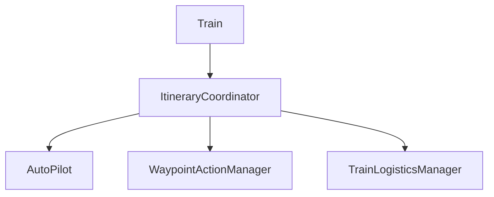
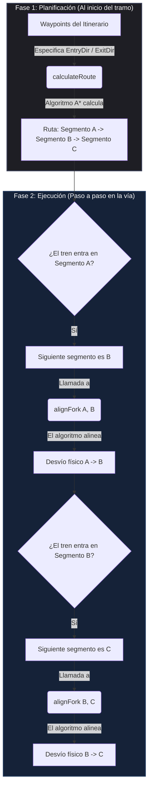
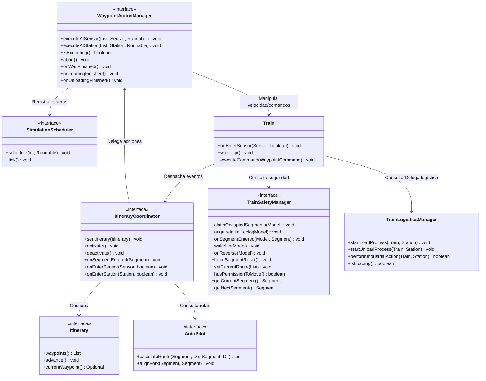
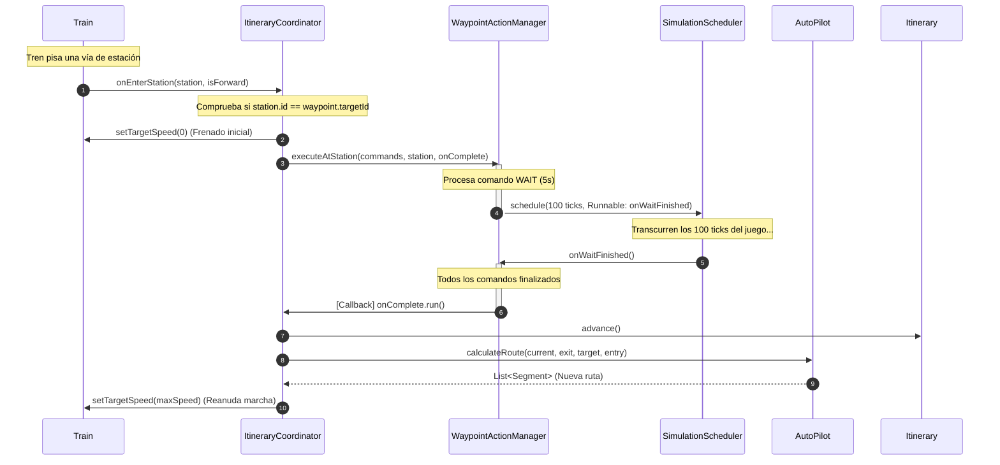
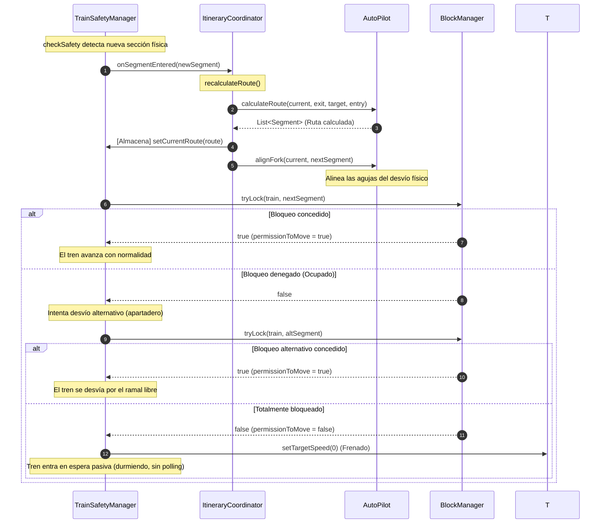

# Análisis General de LeTrain

Este documento recopila las explicaciones, análisis y decisiones de diseño del proyecto LeTrain a medida que se va estudiando y desarrollando la base de código.

---

## 1. Análisis de Model.java

`Model.java` (implementación de la interfaz `letrain.mvp.Model`) es el corazón del estado del simulador. No maneja física detallada ni renderizado gráfico directamente, sino que actúa como el **repositorio de estado consolidado** y el **coordinador de eventos** del mundo procedural.

### 1.1. Arquitectura y Rol en el Patrón MVP
En la arquitectura MVP (Modelo-Vista-Presentador) del proyecto:
* **El Modelo** (`Model`) contiene el estado puro de la simulación (vías, trenes, sensores, economía, señales) y expone métodos para alterarlo.
* No interactúa directamente con la vista. Expone datos mediante getters y notifica cambios a través de eventos que el Presenter escucha.
* Delega lógica compleja a dos servicios internos transitorios para mantener el modelo limpio:
  * **`SimulationService` (internalSimService)**: Encargado de mover trenes, limpiar entidades tras un choque y gestionar la lógica de carga/descarga industrial.
  * **`AutomationEngine` (automationEngine)**: Interpreta y ejecuta el lenguaje de automatización ferroviaria (basado en el parser ANTLR4).

### 1.2. Variables de Estado Clave
* **La Red Ferroviaria**: 
  * `map` ([RailMap](file:///home/antonio/dev/LeTrain/src/main/java/letrain/map/impl/RailMap.java)): Estructura bidimensional que contiene qué vía (`RailTrack`) está en qué coordenadas (`Point`).
  * `groundMap` ([GroundMap](file:///home/antonio/dev/LeTrain/src/main/java/letrain/ground/GroundMap.java)): Terreno procedural generado mediante Perlin Noise que define la ubicación de industrias y recursos.
* **Las Entidades Móviles**:
  * `locomotives` y `wagons`: Listas de todas las locomotoras y vagones activos en el juego.
  * `cursor` ([Cursor](file:///home/antonio/dev/LeTrain/src/main/java/letrain/vehicle/impl/Cursor.java)): Posición y dirección del cursor de edición del usuario.
* **Los Dispositivos de Vía (Track Devices)**:
  * `forks` (`ForkRailTrack`): Desvíos ferroviarios.
  * `sensors` (`Sensor`): Sensores de paso de trenes.
  * `semaphores` (`RailSemaphore`): Semáforos que regulan el tráfico.
  * `stations` (`Station`): Estaciones de carga/descarga (que heredan de `Sensor`).
* **El Gestor Económico**:
  * `economyManager` ([EconomyManager](file:///home/antonio/dev/LeTrain/src/main/java/letrain/economy/EconomyManager.java)): Centraliza el dinero del jugador y deduce/añade fondos según las acciones que ocurren en el modelo (construcción, accidentes, entrega de mercancías).

### 1.3. Ciclo de Vida y Persistencia (Mecanismo de Jackson y `ModelMixin`)
Debido a las referencias cruzadas de la simulación (ej. un vagón conoce su tren, el cual conoce sus locomotoras y las vías que ocupa), se utiliza un mecanismo de serialización configurado en **`ModelMixin.java`**:
* **Anotación `@JsonIdentityInfo`**: Utiliza un generador de secuencias de IDs (`@id` en el JSON) para serializar referencias circulares sin duplicar datos ni entrar en bucles recursivos.
* **Anotación `@JsonIgnore`**: Se aplica a variables que no deben persistirse porque son transitorias de la sesión activa, tales como:
  * Los componentes de servicio (`automationEngine`, `internalSimService`).
  * El `blockManager` (bloqueos dinámicos de cantones).
  * Referencias de selección actuales de UI (`selectedLocomotive`, `selectedFork`, etc.).
  * Los listeners de eventos de trenes (`trainEventListeners`).
* **Inicialización Post-Carga (`postLoadInit`)**:
  * Tras deserializar el JSON, Jackson deja los campos marcados con `@JsonIgnore` como nulos.
  * `postLoadInit()` reconstruye las dependencias transitorias y reestablece los listeners del sistema.
  * Utiliza reflexión de Java para inyectar dinámicamente el `seed` cargado y el `economyManager` de vuelta en el generador de ruido (`PerlinNoise`) del `groundMap`.
  * Llama a `reestablishSystemListeners()`, que vuelve a suscribir los sensores, desvíos, estaciones y semáforos a sus respectivos emisores de eventos.

### 1.4. Grafo Ferroviario y Bloques de Seguridad (Block Safety System)
La prevención de colisiones se basa en cantones de seguridad gestionados por el modelo:
* **Grafo Topológico (`RailwayGraph`)**: 
  * Se genera de manera perezosa (lazy) mediante `TopologyServiceImpl` analizando el mapa de vías (`RailMap`) cuando se llama a `getRailwayGraph()`.
* **Flag `mapChanged` y "Tabula Rasa"**:
  * Cuando el usuario edita el mapa en modo `RAILS`, se activa `mapChanged = true`.
  * Al salir del modo de edición de vías (llamando a `setMode`), si `mapChanged` es verdadero, el modelo activa una **"Tabula Rasa"**:
    1. Limpia por completo el `blockManager` (`blockManager.clearAll()`).
    2. Invalida el grafo topológico (`currentGraph = null`) para forzar un recálculo desde cero.
    3. Recorre cada locomotora activa y fuerza a su tren a revincularse (`loco.getTrain().rebind()`). Esto hace que los trenes vuelvan a calcular sobre qué segmento de vía están y adquieran nuevos bloqueos de seguridad en base a la nueva topología.

### 1.5. Gestión de Entidades e Interacción con UI/Tests
* **Manipulación de Vías**: Al añadir o remover vías (`addTrack`, `removeTrack`), el modelo detecta automáticamente si la vía contiene periféricos (desvíos, semáforos, sensores, estaciones), actualiza las listas internas correspondientes, calcula los costes en el `economyManager` y marca `mapChanged = true`.
* **Patrón Visitor para Renderizado**: La capa visual (Lanterna 2D y LibGDX 3D) implementa un visitante de renderizado que recorre el `RailMap` del modelo sin acoplar la lógica física con la representación gráfica.
* **Testing**: `Model.java` es el foco principal de las pruebas de integración en `src/test/java/letrain`, donde se construyen circuitos sintéticos y se comprueba el comportamiento físico y lógico del movimiento de locomotoras y cantones de seguridad.

---

## 2. Análisis de Train.java y sus Gestores Delegados

La entidad `Train.java` (en el paquete `letrain.vehicle.rail.impl`) representa una composición ferroviaria que agrupa una o más locomotoras y múltiples vagones (eslabones de tipo `Linker`). Su diseño inicial monolítico fue refactorizado siguiendo el **Principio de Responsabilidad Única (SRP)**, delegando sus funciones críticas a gestores especializados.

### 2.1. Arquitectura de Composición y Delegados
Un objeto `Train` centraliza el estado agregando los siguientes componentes de control internos:
1.  **`TrainMovementManager` (movementManager)**: Orquesta las físicas de desplazamiento físico, la validación de movimiento paso a paso y la resolución de choques/colisiones.
2.  **`TrainSafetyManager` (safetyManager)**: Administra la lógica de cantones (ADR-005), la negociación de bloqueos sobre la topología ferroviaria y la prevención de colisiones lógicas.
3.  **`TrainLogisticsManager` (logisticsManager)**: Gestiones industriales (carga y descarga de vagones).
4.  **`TrainCouplingManager` (trainCouplingManager)**: Controla el acoplamiento (unión de vagones en los extremos) y desacoplamiento (división de trenes).
5.  **`AutoPilot` (autopilot)**: Conduce el tren de forma autónoma (ADR-008) siguiendo un itinerario de waypoints programado.

### 2.2. Algoritmo de Movimiento de Eslabones (Two-Pass Movement)
El movimiento físico de las composiciones, implementado en `TrainMovementManager.moveLinkers(boolean)`, utiliza un algoritmo robusto en dos fases:
* **Fase 1: Validación**:
  * Recorre los eslabones (`Linker`s) en el orden de marcha (de la cabeza a la cola).
  * Determina la vía siguiente a ocupar y comprueba si la transición física es válida.
  * **Detección de Colisiones**: Si la vía de destino está reservada o contiene un eslabón de otro tren:
    * Si la velocidad del tren es alta (>= `CRASH_SPEED_THRESHOLD` = 5), se desencadena una colisión destructiva (`crash()`) que destruye ambos convoyes, notifica a la economía y libera los cantones en el `BlockManager`.
    * Si la velocidad es baja (< 5) o está en modo de maniobra (*shunting*), se trata como un mero contacto físico: detiene ambas locomotoras inmediatamente y previene descarrilamientos.
  * Reserva temporalmente las vías siguientes.
* **Fase 2: Ejecución**:
  * Si la validación es un éxito completo para todo el tren, se desplazan físicamente los vagones a su nueva posición y dirección.
  * **Rollback en fallo**: Si por algún motivo inesperado falla la entrada física de un vagón en una vía, el algoritmo deshace las posiciones y revierte los vagones a su vía anterior para evitar corromper la consistencia física del tren.
  * Notifica a sensores, semáforos y desvíos cruzados la correspondiente salida (`onExitTrain`) y entrada (`onEnterTrain`).

### 2.3. Sistema de Seguridad y Cantones (`TrainSafetyManager`)
Es el encargado de cumplir con los protocolos de seguridad definidos en la arquitectura (ADR-005):
* **Comprobación de Seguridad (`checkSafety`)**:
  * Se ejecuta en cada frame/tick del ciclo de simulación.
  * Resuelve el segmento actual que ocupa la locomotora líder.
  * **Overshoot (Sobrepaso)**: Si el tren cambia de segmento físico sin haber obtenido previamente un permiso de movimiento explícito de ese segmento (`permissionToMove == false`), se marca un estado de error de rebase (*overshot*). El tren de manera inmediata desactiva su piloto automático, frena a velocidad 0 y bloquea el segmento ocupado por seguridad.
  * **Reserva de Segmento Siguiente (Comportamiento Actual basado en Ticks/Polling)**:
    * En condiciones normales, el tren solicita el bloqueo del siguiente cantón (`nextSegment`) en su ruta en el `BlockManager`.
    * Si el bloqueo es denegado (está ocupado), busca de forma autónoma una **vía/segmento alternativo** (ej. un bucle de apartadero o sobrepaso) mediante `findAlternativeSegment()`. Si la ruta alternativa comparte el mismo nodo de destino y está libre, el tren se redirige automáticamente por allí.
    * Si la vía alternativa también está bloqueada, el tren se detiene y establece un temporizador de reintento en ticks (`safetyRetryTimer = SAFETY_RETRY_TICKS`, equivalente a 15 segundos o 300 ticks).
    * En cada tick del ciclo de simulación, si el permiso de movimiento sigue denegado, el gestor decrementa este temporizador (`safetyRetryTimer--`). Cuando llega a cero, realiza un reintento síncrono de bloqueo en el siguiente tick.
* **Liberación Dinámica (`releaseOldSegmentsOnForkExit`)**:
  * Tan pronto como la cola del tren sale físicamente de un desvío o sección compleja, el gestor de seguridad libera dinámicamente los segmentos que ya no se ocupan, previniendo cuellos de botella en la red.

### 2.4. Logística de Carga e Itinerarios Autónomos
* **Control de Carga/Descarga**: Delegado a `TrainLogisticsManager`. Cuando un tren se detiene en una estación compatible con su carga, bloquea el avance físico y activa el estado `isLoading = true`. El tiempo necesario para completar la operación es dinámico y depende de la cantidad total de vagones útiles en la composición.
* **Control del AutoPilot**: Ejecuta las órdenes de itinerario (`WaypointCommand`). Al activarse un sensor o llegar a una parada planificada, el piloto automático evalúa las acciones necesarias (detenerse, cargar/descargar mercancía, invertir el sentido de la marcha, o reajustar la velocidad objetivo de las locomotoras).

---

## 3. Rediseño Reactivo por Eventos: Desacoplamiento de Navegación, Coordinación y Acciones

Para lograr el nivel óptimo de desacoplamiento y seguir estrictamente el Principio de Responsabilidad Única (SRP), la conducción autónoma se divide en tres componentes independientes gobernados por eventos físicos:



1.  **AutoPilot (El Navegador)**: Utility pasiva y sin estado dedicada exclusivamente a calcular trayectorias de cantones (`calculateRoute`) y asegurar la alineación de desvíos (`alignFork`).
2.  **WaypointActionManager (El Ejecutor de Acciones)**: Componente enfocado únicamente en ejecutar de forma secuencial una lista concreta de comandos de un waypoint (deteniendo el tren si es necesario, solicitando esperas al planificador y gestionando los estados de carga). Una vez completados los comandos, avisa de su finalización mediante un callback (`onComplete`).
3.  **ItineraryCoordinator (El Coordinador Principal)**: Orquesta el estado global del itinerario (en qué waypoint está el tren), gestiona la activación y desactivación de la conducción autónoma del tren, enlaza las peticiones de recalculado de rutas con el `AutoPilot`, y delega en el `WaypointActionManager` la ejecución de comandos cuando el tren pisa un sensor.

---

### 3.1. Flujo Operativo Guiado por Eventos
*   **Evento de Entrada (`onEnterSensor` / `onEnterStation`)**:
    *   Al desplazarse celda a celda, cuando la cabeza del tren pisa físicamente una estación o un sensor, se dispara el evento `Train.onEnterSensor(sensor, isForward)`.
    *   El método despachador del `Train` realiza un chequeo de tipos: si el sensor es una instancia de `Station`, invoca el canal especializado de estaciones `onEnterStation(Station, isForward)` en el `ItineraryCoordinator`; de lo contrario, invoca el canal básico `onEnterSensor(Sensor, isForward)`.
    *   El `ItineraryCoordinator` comprueba si el identificador del sensor/estación corresponde al `targetId` del waypoint actual del itinerario.
        *   **Coincidencia (Llegada)**: 
            *   **Si el waypoint tiene acciones/comandos**: Detiene la locomotora (`setTargetSpeed(0)`) y delega la ejecución en el `WaypointActionManager` (invocando `executeAtSensor` o `executeAtStation` según el caso). Este administra las esperas y cargas industriales (estas últimas accediendo de forma segura y tipada a la `Station` o `Sensor` correspondiente). Una vez completadas, avanza el itinerario, calcula la nueva ruta y reanuda la marcha.
            *   **Si el waypoint NO tiene acciones/comandos (paso de largo)**: El tren prosigue su avance sin detenerse (manteniendo su velocidad actual). Avanza el itinerario al siguiente waypoint, solicita la nueva ruta al `AutoPilot` y alinea desvíos sobre la marcha de forma totalmente fluida.
*   **Gestión de Cantones Bloqueados y Event-Driven Wakeup**:
    *   Si el `TrainSafetyManager` determina que el segmento siguiente de la ruta provista por el navegador está ocupado en el `BlockManager`:
        *   El gestor de seguridad comprueba si el desvío actual tiene un ramal alternativo que conecte con la misma salida (`farNode`).
        *   Verifica si el segmento original bloqueado carece de waypoints planificados pendientes (`!train.containsWaypointElement(nextSegment)`).
        *   Si se cumplen las condiciones, se toma el ramal alternativo, reescribiendo la ruta y alineando el desvío.
        *   Si no es posible tomar la alternativa, se detiene el tren (`setTargetSpeed(0)`) y este entra en estado de espera pasiva (durmiendo). Se elimina por completo la necesidad de un temporizador de reintento (`safetyRetryTimer`).
        *   El tren permanece dormido hasta que el `BlockManager` notifica reactivamente la liberación del segmento exacto que lo bloqueaba. En ese momento, el despachador de eventos invoca a `train.wakeUp()`, lo que reactiva el chequeo de seguridad, solicita adquirir el bloqueo y reanuda el movimiento si se le concede el paso.
*   **Pasarse de Frenada (Overshoot)**:
    *   Si durante el frenado de seguridad el tren invade el siguiente cantón sin la debida reserva, el gestor de seguridad desactiva de inmediato el `WaypointActionManager` y detiene el tren, retornándolo al modo de control manual.

---

### 3.2. Filosofía de Navegación: Planificación (calculateRoute) vs Ejecución (alignFork)

Para evitar reevaluaciones innecesarias y maximizar la eficiencia del sistema de guiado, el flujo de navegación autónoma se divide en dos fases con responsabilidades y alcances claramente diferenciados:

1. **Fase 1: Planificación (Cálculo de la Ruta Global)**
   * **Cuándo ocurre**: Se ejecuta únicamente al activar el piloto automático o al completar un waypoint y avanzar al siguiente.
   * **Operación**: Se invoca a `calculateRoute(currentSegment, exitDir, targetSegment, entryDir)`.
   * **Responsabilidad**: El pathfinder calcula la secuencia de segmentos completa respetando la dirección de salida actual del tren (`exitDir`) y la dirección de entrada obligatoria al destino (`entryDir`).
   * **Resultado**: Una lista ordenada de segmentos topológicos (ej. `[Segmento A, Segmento B, Segmento C]`).

2. **Fase 2: Ejecución (Marcha y Alineación de Desvíos)**
   * **Cuándo ocurre**: Se ejecuta en tiempo real celda a celda, a medida que la cabeza del tren avanza y detecta la entrada a un nuevo segmento.
   * **Operación**: Se invoca a `alignFork(fromSegment, toSegment)`.
   * **Responsabilidad**: Dado que la secuencia de segmentos ya fue definida en la Fase 1, no es necesario volver a evaluar direcciones ni orientaciones globales. El sistema simplemente analiza la frontera de transición entre el segmento actual (`fromSegment`) y el siguiente (`toSegment`) en la lista de la ruta, identifica el desvío físico compartido y alinea mecánicamente sus agujas.



---

### 3.3. Contratos e Interfaces del Sistema

A continuación se definen las interfaces claras, autoexplicativas y robustas para el navegador (`AutoPilot`), el ejecutor de acciones (`WaypointActionManager`), el programador central (`SimulationScheduler`) y el coordinador de itinerarios (`ItineraryCoordinator`).

#### A. Contrato del Navegador: `AutoPilot.java`
```java
package letrain.itinerary;

import java.util.List;
import letrain.segments.Segment;
import letrain.map.Dir;

/**
 * Representa el motor de navegación puro y pasivo de la red ferroviaria.
 * Su única función es realizar cálculos matemáticos/topológicos sobre el grafo
 * de vías y alinear los desvíos físicos intermedios para guiar al tren.
 * 
 * No contiene estado operativo sobre waypoints, velocidad, carga o temporizadores.
 */
public interface AutoPilot {

    /**
     * Calcula la secuencia de cantones (segmentos) óptima que debe recorrer el tren 
     * desde su posición actual hasta alcanzar el segmento del objetivo final.
     * En el cálculo se definen la dirección de salida del segmento de inicio y
     * la dirección de entrada del segmento de destino de forma explícita.
     *
     * @param current  Segmento en el que se encuentra actualmente la locomotora líder.
     * @param exitDir  Dirección en la cual el tren está viajando y por la cual debe 
     *                 salir del segmento de inicio.
     * @param target   Segmento destino donde está situado el waypoint objetivo.
     * @param entryDir Dirección de entrada obligatoria en el segmento de destino.
     * @return Una lista ordenada de {@link Segment} que representa el camino completo. 
     *         Retorna una lista vacía si no existe ninguna ruta viable.
     * @throws IllegalArgumentException si alguno de los parámetros obligatorios es nulo.
     */
    List<Segment> calculateRoute(Segment current, Dir exitDir, Segment target, Dir entryDir);

    /**
     * Asegura la alineación física del desvío (fork) situado en la frontera de transición
     * entre dos segmentos consecutivos. Esto garantiza que las agujas estén orientadas
     * hacia la salida adecuada antes de que el tren cruce.
     *
     * @param from Segmento de origen.
     * @param to   Segmento consecutivo de destino.
     * @throws IllegalArgumentException si no existe una conexión topológica directa 
     *                                  o compartida entre ambos segmentos.
     */
    void alignFork(Segment from, Segment to);
}
```

#### B. Contrato del Programador de Tareas: `SimulationScheduler.java`
```java
package letrain.utils;

/**
 * Servicio de planificación de tareas reactivas basado en ticks del simulador.
 * Permite a cualquier componente delegar la ejecución diferida de lógica
 * (como las esperas de itinerario) sin necesidad de que las clases individuales 
 * o las locomotoras arrastren temporizadores manuales en sus bucles principales.
 */
public interface SimulationScheduler {

    /**
     * Planifica una tarea para ser ejecutada de manera reactiva después de un número 
     * determinado de ticks del reloj de simulación.
     *
     * @param ticksDelay Cantidad de ticks a esperar (a 20 FPS, 20 ticks = 1 segundo).
     * @param task       La acción ({@link Runnable}) a ejecutar tras expirar la espera.
     * @throws IllegalArgumentException si ticksDelay es negativo o task es nula.
     */
    void schedule(int ticksDelay, Runnable task);

    /**
     * Incrementa un tick en el reloj del programador y evalúa el disparo de las tareas 
     * cuya espera ha expirado en este ciclo.
     * Debe ser llamado de manera centralizada desde el bucle principal de simulación.
     */
    void tick();

    /**
     * Cancela y vacía todas las tareas diferidas que se encuentren actualmente pendientes.
     */
    void clear();
}
```

#### C. Contrato del Ejecutor de Comandos: `WaypointActionManager.java`
```java
package letrain.itinerary;

import java.util.List;
import letrain.track.Sensor;
import letrain.track.Station;

/**
 * Ejecutor dedicado de secuencias de comandos de waypoints.
 * No conoce el progreso general del itinerario, desvíos, ni los estados de activación
 * del modo automático. Su única responsabilidad es recibir una cola de comandos y 
 * ejecutarlos secuencialmente en el tren (frenar, cambiar marcha, etc.) notificando
 * cuando ha concluido todo el bloque de tareas.
 */
public interface WaypointActionManager {

    /**
     * Ejecuta comandos en el contexto específico de un sensor básico (no estación).
     * Al terminar con éxito la totalidad de las acciones, invocará el callback {@code onComplete}.
     *
     * @param commands   La secuencia de comandos a ejecutar.
     * @param sensor     El sensor físico donde se encuentra el tren.
     * @param onComplete Callback ejecutable de finalización.
     * @throws IllegalArgumentException si la lista de comandos o el callback son nulos.
     */
    void executeAtSensor(List<WaypointCommand> commands, Sensor sensor, Runnable onComplete);

    /**
     * Ejecuta comandos en el contexto específico de una estación ferroviaria (carga/descarga).
     *
     * @param commands   La secuencia de comandos a ejecutar.
     * @param station    La estación física donde se encuentra el tren.
     * @param onComplete Callback ejecutable de finalización.
     */
    void executeAtStation(List<WaypointCommand> commands, Station station, Runnable onComplete);

    /**
     * Indica si el ejecutor se encuentra actualmente procesando acciones pendientes
     * (por ejemplo, en medio de una espera temporal de estación o carga/descarga activa).
     *
     * @return true si está ocupado ejecutando comandos, false si está inactivo.
     */
    boolean isExecuting();

    /**
     * Aborta de forma inmediata cualquier acción en ejecución y limpia la cola 
     * de comandos pendientes, dejando el gestor libre para nuevas peticiones.
     */
    void abort();

    /**
     * Callback reactivo invocado por el planificador de simulación cuando 
     * finaliza un comando de espera (WAIT).
     */
    void onWaitFinished();

    /**
     * Callback reactivo invocado por el gestor de logística cuando finaliza
     * una operación de carga industrial.
     */
    void onLoadingFinished();

    /**
     * Callback reactivo invocado por el gestor de logística cuando finaliza
     * una operación de descarga industrial.
     */
    void onUnloadingFinished();
}
```

#### D. Contrato del Coordinador General: `ItineraryCoordinator.java`
```java
package letrain.itinerary;

import java.util.Optional;
import letrain.track.Sensor;
import letrain.track.Station;
import letrain.segments.Segment;

/**
 * Coordinador central de la navegación y la autonomía ferroviaria de un tren.
 * Vincula el itinerario (waypoints), el navegador (AutoPilot) y el ejecutor 
 * de acciones (WaypointActionManager) para gobernar la conducción autónoma.
 * 
 * Expone callbacks reactivos específicos y tipados que son llamados en respuesta 
 * a eventos físicos reales detectados por la vía, evitando casteos internos.
 */
public interface ItineraryCoordinator {

    /**
     * Asigna un itinerario planificado para que el tren comience su recorrido.
     *
     * @param itinerary El itinerario a configurar.
     */
    void setItinerary(Itinerary itinerary);

    /**
     * Devuelve el itinerario asignado activo.
     *
     * @return Un {@link Optional} que contiene el itinerario, o vacío si no hay ninguno.
     */
    Optional<Itinerary> getItinerary();

    /**
     * Activa la conducción autónoma del tren. Inicializa la ruta y desvíos
     * para el primer waypoint del itinerario.
     */
    void activate();

    /**
     * Desactiva la conducción autónoma, cancela cualquier comando de waypoint activo
     * en el {@link WaypointActionManager} y detiene el tren transfiriendo el control a manual.
     */
    void deactivate();

    /**
     * Indica si el control autónomo coordinado está actualmente en funcionamiento.
     *
     * @return true si la autonomía está activa, false en caso de conducción manual.
     */
    boolean isActive();

    /**
     * Callback reactivo de entrada a un segmento físico (disparado por TrainSafetyManager).
     * Permite al coordinador reevaluar la ruta y solicitar al AutoPilot que alinee desvíos.
     *
     * @param currentSeg El segmento físico en el que acaba de entrar la cabeza del tren.
     */
    void onSegmentEntered(Segment currentSeg);

    /**
     * Callback reactivo disparado por el tren cuando su cabeza física entra
     * en un sensor básico (no estación).
     *
     * Si el identificador del sensor coincide con el target del waypoint actual:
     * - Si el waypoint contiene comandos: detiene el tren y delega la ejecución en {@link WaypointActionManager}.
     * - Si el waypoint NO contiene comandos (paso de largo): avanza al siguiente waypoint de forma fluida.
     *
     * @param sensor    El sensor en el que ha ingresado el tren.
     * @param isForward Sentido de la marcha del tren al ingresar.
     */
    void onEnterSensor(Sensor sensor, boolean isForward);

    /**
     * Callback reactivo disparado por el tren cuando su cabeza física entra
     * en una estación de carga/descarga.
     *
     * Si el identificador de la estación coincide con el target del waypoint actual:
     * - Si el waypoint contiene comandos: detiene el tren y delega la ejecución en {@link WaypointActionManager},
     *   pasándole la instancia tipada de la estación para sus operaciones industriales.
     * - Si el waypoint NO contiene comandos (paso de largo): avanza al siguiente waypoint de forma fluida.
     *
     * @param station   La estación en la que ha ingresado el tren.
     * @param isForward Sentido de la marcha del tren al ingresar.
     */
    void onEnterStation(Station station, boolean isForward);
}
```

#### E. Contrato del Gestor de Seguridad: `TrainSafetyManager.java`
```java
package letrain.vehicle;

import java.util.List;
import letrain.mvp.Model;
import letrain.segments.Segment;

/**
 * Define el contrato para el gestor de seguridad y control de cantones del tren.
 * Se encarga de evaluar si la vía por la que circula el tren es segura, de solicitar
 * reservas de bloques y de gestionar las paradas de emergencia en caso de sobrepaso (overshoot).
 */
public interface TrainSafetyManager {

    /**
     * Reclama y reserva en el BlockManager todos los segmentos ocupados físicamente
     * por la composición del tren (locomotoras y vagones). Se llama al inicializar el
     * mapa (Tabula Rasa) o al cargar una partida.
     *
     * @param model El modelo central del simulador.
     */
    void claimOccupiedSegments(Model model);

    /**
     * Realiza las reservas iniciales de cantones (segmento actual y siguiente)
     * necesarias para arrancar la marcha del tren de forma segura.
     *
     * @param model El modelo central del simulador.
     */
    void acquireInitialLocks(Model model);

    /**
     * Se dispara cuando el tren entra físicamente en un nuevo segmento.
     * Libera los segmentos rebasados por la cola e intenta reservar el siguiente cantón.
     *
     * @param model      El modelo central.
     * @param newSegment El segmento físico al que acaba de entrar la cabeza.
     */
    void onSegmentEntered(Model model, Segment newSegment);

    /**
     * Despierta reactivamente al gestor de seguridad tras la liberación de un tramo bloqueado.
     * Intenta reservar el segmento siguiente que causó la parada.
     *
     * @param model El modelo central.
     */
    void wakeUp(Model model);

    /**
     * Se dispara al invertir el sentido de marcha del tren. Libera el bloqueo del
     * segmento de avance anterior e intenta reservar el segmento en el nuevo sentido.
     *
     * @param model El modelo central.
     */
    void onReverse(Model model);

    /**
     * Fuerza el reinicio del segmento actual (invalida la posición).
     */
    void forceSegmentReset();

    /**
     * Establece la ruta de segmentos que el tren planea recorrer.
     *
     * @param route Lista ordenada de {@link Segment} que componen la ruta activa.
     */
    void setCurrentRoute(List<Segment> route);

    /**
     * Indica si el tren tiene autorización de seguridad para continuar moviéndose.
     *
     * @return true si tiene permiso, false en caso de detención forzada por seguridad.
     */
    boolean hasPermissionToMove();

    /**
     * Obtiene el segmento físico en el que se encuentra actualmente la locomotora líder.
     *
     * @return El {@link Segment} actual, o null si no se encuentra en una vía registrada.
     */
    Segment getCurrentSegment();

    /**
     * Obtiene el siguiente segmento en el itinerario que el tren está intentando reservar.
     *
     * @return El {@link Segment} siguiente, o null si no hay un segmento planificado a continuación.
     */
    Segment getNextSegment();
}
```

---

## 4. Diagramas de Arquitectura y Flujos

Los siguientes diagramas detallan la estructura y la secuencia temporal de eventos bajo la arquitectura reactiva desacoplada.

### 4.1. Diagrama de Clases y Relaciones
Este diagrama representa la estructura de interfaces, la separación de responsabilidades y las dependencias entre los componentes de control y soporte.



### 4.2. Secuencia: Entrada a Estación y Ejecución de Espera (WAIT)
El siguiente diagrama detalla qué ocurre cuando el tren pisa físicamente una estación que coincide con su waypoint objetivo, realiza una parada y una espera de tiempo, y reanuda la marcha de forma 100% reactiva.



### 4.3. Secuencia: Cambio de Segmento y Enrutamiento de Desvíos
Muestra cómo colaboran el gestor de seguridad, el coordinador y el navegador pasivo cuando el tren cruza la frontera hacia un nuevo segmento.


