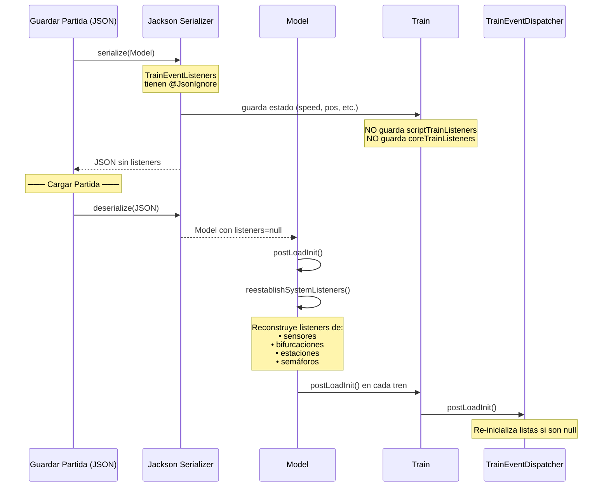

[ [Índice] ] [[docs/Index|⬅️ Volver al Índice]]

# Sistema de Eventos de Tren

El sistema de eventos de LeTrain sigue el patrón **Observer** multicapa para desacoplar los componentes del simulador. Cuando un tren se mueve, acopla, choca o pasa por un sensor, se disparan eventos que notifican tanto a componentes internos del sistema (audio, logging, economía) como a scripts de automatización del usuario.

## Arquitectura General

```
┌─────────────────────────────────────────────────────────────────────┐
│                         Train                                       │
│  ┌──────────────────────────────────────────────────────────────┐   │
│  │                  TrainEventDispatcher                        │   │
│  │                                                              │   │
│  │  ┌─────────────────────┐  ┌─────────────────────┐            │   │
│  │  │ Script Listeners    │  │ Core Listeners      │            │   │
│  │  │CopyOnWriteArrayList │  │ CopyOnWriteArrayList│            │   │
│  │  │                     │  │                     │            │   │
│  │  │  • CommandManager   │  │  • Model (logging)  │            │   │
│  │  │  (automatización    │  │  • TerminalPresenter│            │   │
│  │  │   del usuario)      │  │  • GraphicPresenter │            │   │
│  │  │                     │  │  • Station          │            │   │
│  │  └─────────────────────┘  └─────────────────────┘            │   │
│  └──────────────────────────────────────────────────────────────┘   │
└─────────────────────────────────────────────────────────────────────┘
                              │
                              │ notifica a través de
                              ▼
                    ┌──────────────────┐
                    │TrainEventListener│
                    │(interfaz con     │
                    │ métodos default) │
                    └──────────────────┘
```

**Principio fundamental**: Los eventos **NO** se procesan en `tick()` ni `advance()`. El sistema es reactivo y event-driven: las acciones del tren (movimiento, colisiones, acoplamiento) disparan notificaciones que los listeners procesan fuera del bucle de física.

## TrainEventDispatcher

**Ubicación**: `src/main/java/letrain/vehicle/rail/impl/TrainEventDispatcher.java`

El `TrainEventDispatcher` es el núcleo de la gestión de eventos de cada tren. Centraliza el registro y la notificación de eventos, separando los listeners en dos categorías:

### Listener de Doble Nivel

| Categoría | Tipo de Lista | Propósito | Ejemplos |
|---|---|---|---|
| **Script** | `CopyOnWriteArrayList<TrainEventListener>` | Automatización definida por el usuario (vía ANTLR) | `CommandManager` |
| **Core** | `CopyOnWriteArrayList<TrainEventListener>` | Componentes internos del sistema | `Model` (logging), `TerminalPresenter` (audio), `GraphicPresenter` (audio), `Station` |

### Ciclo de Vida del Dispatcher

```
Creación del Tren
       │
       ▼
new TrainEventDispatcher(train)
       │
       ▼
Registro de listeners (addScriptTrainEventListener / addCoreTrainEventListener)
       │
       ▼
  ┌────┴────┐
  │         │
Evento    Serialización (Jackson)
  │         │
  ▼         ▼
notifyXxx()  postLoadInit()
  │         │
  ▼         ▼
Recorre listas  Re-inicializa listas
y llama a cada  (CopyOnWriteArrayList)
listener       si son null
```

### Métodos de Notificación del Dispatcher

Cada método recorre **ambas** listas (script y core) en orden:

| Método | Evento | Método en TrainEventListener |
|---|---|---|
| `notifySpeedChanged(int speed)` | Cambio de velocidad | `onSpeedChanged(speed)` |
| `notifySenseChanged(boolean forward)` | Cambio de dirección (marcha atrás) | `onSenseChanged(forward)` |
| `notifyLink()` | Acoplamiento con otro tren | `onLink(train)` |
| `notifyUnlink()` | Desacoplamiento | `onUnlink(train)` |
| `notifyEnterSensor(Sensor, boolean)` | Entrada a sensor | `onSensorEnter(train, isForward)` |
| `notifyExitSensor(Sensor, boolean)` | Salida de sensor | `onSensorExit(train, isForward)` |
| `notifySegmentOccupied(Segment)` | Ocupación de segmento de vía | `onSegmentOccupied(train, segment)` |
| `notifyContact(Point, int)` | Contacto a baja velocidad (< 5) | `onContact(train, pos, speed)` |
| `notifyCrash(Point, int)` | Colisión a alta velocidad (>= 5) | `onCrash(train, pos, speed)` |

---

## TrainEventListener

**Ubicación**: `src/main/java/letrain/vehicle/rail/TrainEventListener.java`

```java
public interface TrainEventListener extends Serializable {
    default void onSpeedChanged(int speed) {}
    default void onSenseChanged(boolean forward) {}
    default void onLink(Train train) {}
    default void onUnlink(Train train) {}
    default void onCrash(Train train, Point pos, int speed) {}
    default void onContact(Train train, Point pos, int speed) {}
    default void onSensorEnter(Train train, boolean isForward) {}
    default void onSensorExit(Train train, boolean isForward) {}
    default void onSegmentOccupied(Train train, Segment segment) {}
}
```

- **Todos los métodos son `default`**: los listeners implementan solo los que necesitan.
- **Extiende `Serializable`**: permite que los listeners script se serialicen con el estado.

---

## Flujo Completo de Eventos

### 1. Eventos de Movimiento y Sensor

El origen de la mayoría de eventos está en `TrainMovementManager.moveLinkers()`. Cuando los linkers (vagones individuales) avanzan por las celdas, se detectan sensores, bifurcaciones, semáforos y segmentos.

```
TrainMovementManager.moveLinkers()
  │
  ├── Salida de celda (último linker)
  │   ├── sensorExit.onExitTrain(train)          → Sensor (SensorEventListener)
  │   ├── currentTrack.getSemaphore().onExitTrain() → Semáforo
  │   └── fork.onExitTrain(train)                  → Bifurcación
  │
  ├── Entrada a nueva celda (primer linker)
  │   ├── train.notifySegmentEntered(newSegment) → SegmentLogger
  │   ├── sensorEnter.onEnterTrain(train)         → Sensor (SensorEventListener)
  │   │       └── Sensor.onSensorEnter() llama a:
  │   │           ├── dispatcher.notifyEnterSensor()  → TrainEventListener.onSensorEnter()
  │   │           └── sensor.listeners.onEnterTrain() → SensorEventListener.onEnterTrain()
  │   ├── nextTrack.getSemaphore().onEnterTrain() → Semáforo
  │   └── fork.onEnterTrain(train)                → Bifurcación
  │
  └── Colisión / Callejón sin salida
      ├── speed >= 5 → train.notifyCrash(pos, speed)
      └── speed < 5  → train.notifyContact(pos, speed)
```

### 2. Eventos de Sensor en Detalle

El `Sensor` es un dispositivo de vía que implementa **dos interfaces de evento simultáneamente**:

```
Sensor implements SensorEventListener, TrainEventListener
```

Cuando un tren entra en una celda con sensor:

```
1. TrainMovementManager llama a sensorEnter.onEnterTrain(train)
2. Sensor.onEnterTrain(train):
   a. train.notifyEnterSensor(this, isForward)
      → dispatcher recorre listeners
      → llama a onSensorEnter() para cada listener
      → PERO salta al propio sensor (l != sensor)
         para evitar auto-recibirse
   b. sensorListeners.forEach(l -> l.onEnterTrain(train))
      → SensorEventListener.onEnterTrain() (otros sensores, estaciones, etc.)
```

### 3. Eventos de Velocidad

```
Locomotive.setCurrentSpeed(int speed)
  │
  └── train.notifySpeedChanged(this.currentSpeed)
        │
        └── dispatcher.notifySpeedChanged(speed)
              │
              ├── Script listeners: onSpeedChanged(speed)
              └── Core listeners:  onSpeedChanged(speed)
```

Cada vez que cambia la velocidad de una locomotora, se notifica a todos los listeners.

### 4. Eventos de Cambio de Dirección

```
Locomotive.toggleReversed()
  │
  └── train.notifySenseChanged(!isReversed())
        │
        └── dispatcher.notifySenseChanged(forward)
```

### 5. Eventos de Acoplamiento/Desacoplamiento

```
TrainCouplingManager.doJoin()
  │
  ├── Lógica de acoplamiento físico
  └── train.notifyLink()
        │
        └── dispatcher.notifyLink()
              ├── Script: onLink(train)
              └── Core:   onLink(train)

TrainCouplingManager.doUnlink()
  │
  ├── Lógica de desacoplamiento
  └── train.notifyUnlink()
        │
        └── dispatcher.notifyUnlink()
              ├── Script: onUnlink(train)
              └── Core:   onUnlink(train)
```

### 6. Eventos de Ocupación de Segmento

```
TrainActionManager.notifySegmentOccupied(Segment segment)
  │
  └── train.notifySegmentOccupied(segment)
        │
        └── dispatcher.notifySegmentOccupied(segment)
              ├── Script: onSegmentOccupied(train, segment)
              └── Core:   onSegmentOccupied(train, segment)
```

---

## Eventos de Dispositivos de Vía (Track Device Events)

Además del sistema `TrainEventListener`, cada dispositivo de vía tiene su propio sistema de eventos con sus propias interfaces:

### Sensor

`SensorEventListener` → `src/main/java/letrain/track/SensorEventListener.java`

```java
public interface SensorEventListener extends Serializable {
    default void onExitTrain(Train train, boolean isForward) {}
    default void onEnterTrain(Train train, boolean isForward) {}
}
```

**Registro**: `Sensor.addSensorListener(SensorEventListener)`

### Estación

`StationEventListener` → `src/main/java/letrain/track/StationEventListener.java`

```java
public interface StationEventListener extends Serializable {
    default void onEnterTrain(Train train, boolean isForward) {}
    default void onExitTrain(Train train, boolean isForward) {}
    default void onLoad(Train train) {}
    default void onUnload(Train train) {}
    default void onStartLoad(Train train) {}
    default void onEndLoad(Train train) {}
    default void onStartUnload(Train train) {}
    default void onEndUnload(Train train) {}
    default void onLink(Train train) {}
    default void onUnlink(Train train) {}
}
```

**Registro**: `Station.addStationListener(StationEventListener)`

**Nota**: `Station` también implementa `TrainEventListener` y se registra como **core listener** del tren cuando este entra, permitiéndole reaccionar a acoplamientos/desacoplamientos dentro de sus límites.

### Bifurcación (Fork)

`ForkEventListener` → `src/main/java/letrain/track/ForkEventListener.java`

```java
public interface ForkEventListener extends Serializable {
    default void onEnterTrain(Train train, boolean isForward) {}
    default void onExitTrain(Train train, boolean isForward) {}
    default void onDirectionChanged(boolean normal) {}
}
```

**Registro**: `ForkRailTrack.addForkListener(ForkEventListener)`

### Semáforo

`SemaphoreEventListener` → `src/main/java/letrain/track/SemaphoreEventListener.java`

```java
public interface SemaphoreEventListener extends Serializable {
    default void onOpen() {}
    default void onClosed() {}
    default void onEnterTrain(Train train, boolean isForward) {}
    default void onExitTrain(Train train, boolean isForward) {}
}
```

**Registro**: `RailSemaphore.addSemaphoreListener(SemaphoreEventListener)`

---

## Ejemplo de Registro de Listeners

### Sistema Core (Model.java)

```java
// Registro de listeners core a nivel global
// Model.addCoreTrainEventListener() los propaga a todos los trenes
public void addCoreTrainEventListener(TrainEventListener listener) {
    if (trainEventListeners == null) {
        trainEventListeners = new CopyOnWriteArrayList<>();
    }
    trainEventListeners.add(listener);
    // También se registra en trenes existentes
    for (Locomotive loc : locomotives) {
        loc.getTrain().addCoreTrainEventListener(listener);
    }
}
```

### Estación (autoregistro dinámico)

```java
// Station.java — se registra como core listener cuando un tren entra
@Override
public void onEnterTrain(Train train, boolean isForward) {
    // ...
    train.addCoreTrainEventListener(this);  // se suscribe a eventos del tren
    notifyEnterTrain(train, isForward);
}

@Override
public void onExitTrain(Train train, boolean isForward) {
    train.removeCoreTrainEventListener(this);  // se desuscribe al salir
    notifyExitTrain(train, isForward);
}
```

### Sistema de Audio (TerminalPresenter)

```java
// TerminalPresenter.java implementa TrainEventListener
// Se registra como core listener para reproducir sonidos
train.addCoreTrainEventListener(this);

// Responde solo a eventos que requieren audio:
@Override
public void onCrash(Train train, Point pos, int speed) {
    audioEngine.play("explosion", pos);
    // detiene sintetizadores de locomotora
}
```

### Automatización (CommandManager)

```java
// CommandManager.java — se registra como script listener
// para ejecutar comandos definidos por el usuario
// cuando el tren pasa por sensores, se acopla, etc.
train.addScriptTrainEventListener(commandListener);

// El listener checkea si hay comandos definidos
// para ese sensor/evento y los ejecuta
```

---

## Serialización y PostLoad

Los listeners **no se serializan** en su totalidad:



**Puntos clave**:
- `TrainEventListeners` tiene `@JsonIgnore` en `Model.java`
- `postLoadInit()` en `TrainEventDispatcher` usa `SerializationHelper.ensureListInitializedConcurrent()` para re-crear las listas
- Los listeners `core` del sistema se re-registran en `Model.reestablishSystemListeners()`
- Los listeners `script` (automatización del usuario) deben re-cargarse desde el script original

---

## Diagrama de Clases del Sistema de Eventos

```
┌─────────────────────────────────────────────────────────────────────────┐
│                        TrainEventListener (interfaz)                    │
│  + onSpeedChanged(int)                                                  │
│  + onSenseChanged(boolean)                                              │
│  + onLink(Train)                                                        │
│  + onUnlink(Train)                                                      │
│  + onCrash(Train, Point, int)                                           │
│  + onContact(Train, Point, int)                                         │
│  + onSensorEnter(Train, boolean)                                        │
│  + onSensorExit(Train, boolean)                                         │
│  + onSegmentOccupied(Train, Segment)                                    │
└─────────────────────────────────────────────────────────────────────────┘
            ▲                    ▲                     ▲
            │                    │                     │
   ┌────────┴────────┐  ┌───────┴───────┐   ┌────────┴──────────┐
   │     Model       │  │ Terminal/     │   │  CommandManager   │
   │  (logging/econ) │  │ GraphicPresent│   │  (script user)    │
   │                 │  │  (audio)      │   │                   │
   │ Core listener   │  │  Core listener│   │  Script listener  │
   └─────────────────┘  └───────────────┘   └───────────────────┘


┌─────────────────────────────────────────────────────────────────────────┐
│                    Interfaces de Dispositivos de Vía                    │
├─────────────────┬─────────────────┬──────────────────┬──────────────────┤
│ SensorEvent     │ StationEvent    │ ForkEvent        │ SemaphoreEvent   │
│ Listener        │ Listener        │ Listener         │ Listener         │
│                 │                 │                  │                  │
│ + onEnterTrain  │ + onEnterTrain  │ + onEnterTrain   │ + onOpen         │
│ + onExitTrain   │ + onExitTrain   │ + onExitTrain    │ + onClosed       │
│                 │ + onLoad        │ + onDirChanged   │ + onEnterTrain   │
│                 │ + onUnload      │                  │ + onExitTrain    │
│                 │ + onStartLoad   │                  │                  │
│                 │ + onEndLoad     │                  │                  │
│                 │ + onStartUnload │                  │                  │
│                 │ + onEndUnload   │                  │                  │
│                 │ + onLink        │                  │                  │
│                 │ + onUnlink      │                  │                  │
└─────────────────┴─────────────────┴──────────────────┴──────────────────┘
```

---

## Relación entre Interfaces de Evento

Las interfaces de evento están organizadas en dos planos independientes:

```
PLANO 1: Eventos de Tren (TrainEventListener)
  Emisor: Train → TrainEventDispatcher
  Propósito: Notificar cambios de estado del tren a componentes del sistema y scripts

PLANO 2: Eventos de Dispositivo de Vía (Sensor/Station/Fork/Semaphore)
  Emisor: Dispositivo de vía → su propia lista de listeners
  Propósito: Notificar eventos de tráfico en puntos específicos de la red

PUENTE: Sensor implementa ambas interfaces
  - Como TrainEventListener: recibe eventos de los trenes que lo atraviesan
    (onSensorEnter desde el dispatcher del tren)
  - Como emisor: notifica a sus propios SensorEventListener
    (otros dispositivos interesados en ese punto de la vía)
```

---

## Invariantes y Buenas Prácticas

1. **Nunca modificar listeners desde dentro de una notificación**: Usar `CopyOnWriteArrayList` para permitir iteración segura aunque un listener se añada/elimine durante la notificación.

2. **Auto-exclusión**: En `notifyEnterSensor` y `notifyExitSensor`, el sensor que origina el evento se excluye de la notificación (`if (l != sensor)`) para evitar ciclos.

3. **Listeners transitorios**: Los listeners no se serializan. Tras cargar una partida, deben reestablecerse vía `postLoadInit()` y `reestablishSystemListeners()`.

4. **Separación script/core**: Los listeners script (automatización del usuario) están aislados de los core (sistema). Los core nunca se eliminan por acciones del usuario.

5. **Eventos acotados**: No hay un bus de eventos global. Cada tren tiene su propio dispatcher, y los dispositivos de vía tienen sus propias listas. Esto mantiene el acoplamiento bajo y el rendimiento predecible.

---

## Archivos Clave

| Archivo | Ruta |
|---|---|
| TrainEventDispatcher | `src/main/java/letrain/vehicle/rail/impl/TrainEventDispatcher.java` |
| TrainEventListener | `src/main/java/letrain/vehicle/rail/TrainEventListener.java` |
| SensorEventListener | `src/main/java/letrain/track/SensorEventListener.java` |
| StationEventListener | `src/main/java/letrain/track/StationEventListener.java` |
| SemaphoreEventListener | `src/main/java/letrain/track/SemaphoreEventListener.java` |
| ForkEventListener | `src/main/java/letrain/track/ForkEventListener.java` |
| EventLogManager | `src/main/java/letrain/mvp/impl/EventLogManager.java` |
| Train.java (firing) | `src/main/java/letrain/vehicle/rail/impl/Train.java` |
| TrainMovementManager (origen) | `src/main/java/letrain/vehicle/rail/impl/TrainMovementManager.java` |
| TrainCouplingManager | `src/main/java/letrain/vehicle/rail/impl/TrainCouplingManager.java` |
| Sensor | `src/main/java/letrain/track/Sensor.java` |
| Station | `src/main/java/letrain/track/Station.java` |
| ForkRailTrack | `src/main/java/letrain/track/rail/ForkRailTrack.java` |
| RailSemaphore | `src/main/java/letrain/track/RailSemaphore.java` |
| Model.java | `src/main/java/letrain/mvp/impl/Model.java` |
| CommandManager | `src/main/java/letrain/command/CommandManager.java` |
| TerminalPresenter | `src/main/java/letrain/mvp/impl/terminal/TerminalPresenter.java` |
| GraphicPresenter | `src/main/java/letrain/mvp/impl/graphic/GraphicPresenter.java` |
