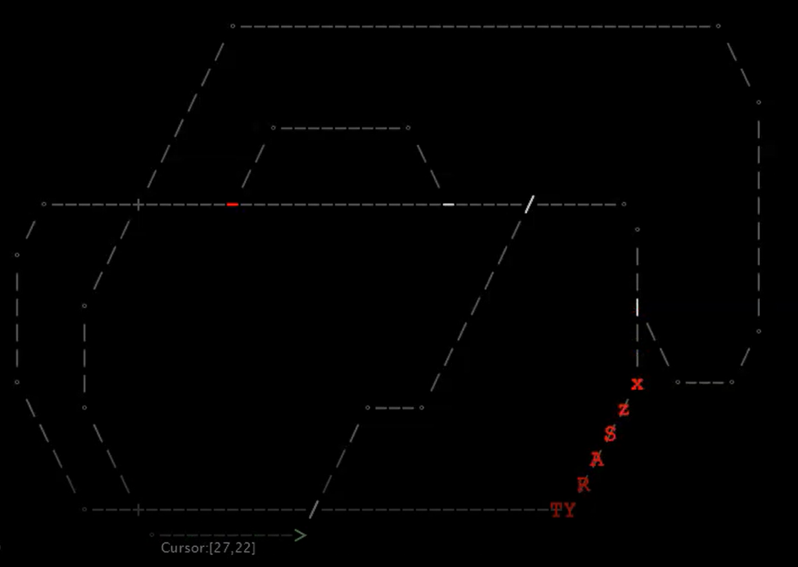

## Welcome to LeTrain, The Letter Train Simulator

This is a little toy made first in C++ and now ported to Java. 
The idea is to play in a plain text mode screen (sort of) with trains, rails, forks, semaphores, stations, loads, passengers, etc.
This is a work in progress, so there's not much to see yet.
Here is an short [example video](https://youtu.be/2WVScFIG4_E)

### Evolution

The C++ version worked in a pure ascii terminal. The Java version is using a simple terminal emulator made with JavaFX. But the idea is to return to the terminal, may be using the .

 

